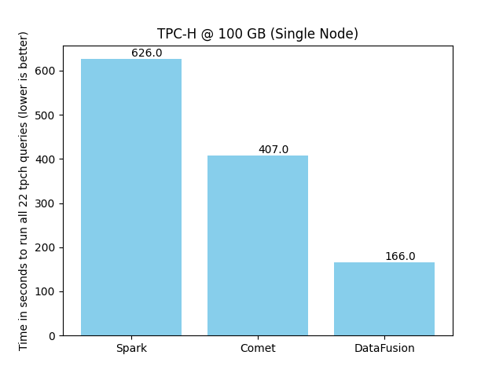
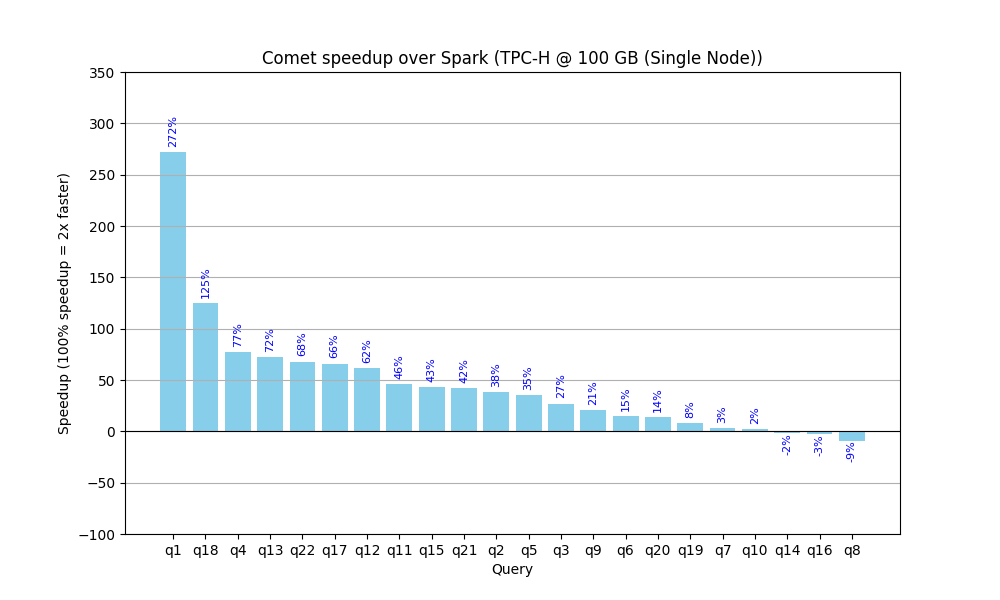

<!--

Licensed to the Apache Software Foundation (ASF) under one or more
contributor license agreements.  See the NOTICE file distributed with
this work for additional information regarding copyright ownership.
The ASF licenses this file to you under the Apache License, Version 2.0
(the "License"); you may not use this file except in compliance with
the License.  You may obtain a copy of the License at

http://www.apache.org/licenses/LICENSE-2.0

Unless required by applicable law or agreed to in writing, software
distributed under the License is distributed on an "AS IS" BASIS,
WITHOUT WARRANTIES OR CONDITIONS OF ANY KIND, either express or implied.
See the License for the specific language governing permissions and
limitations under the License.

-->

The Apache DataFusion PMC is pleased to announce the first official source release of the [Comet](https://datafusion.apache.org/comet/) subproject.

Comet is an accelerator for Apache Spark that translates Spark physical plans to DataFusion physical plans for
improved performance and efficiency without requiring any code changes.

Comet runs on commodity hardware and aims to provide 100% compatibility with Apache Spark. Any operators or
expressions that are not fully compatible will fall back to Spark unless explicitly enabled by the user. Refer
to the [compatibility guide] for more information.

[compatibility guide]: https://datafusion.apache.org/comet/user-guide/compatibility.html

This release covers five months of development work since the project was [donated] to the Apache DataFusion
project and is the result of merging 343 PRs from 41 contributors. See the [change log] for more information.

[donated]: https://datafusion.apache.org/blog/2024/03/06/comet-donation/
[change log]: https://github.com/apache/datafusion-comet/blob/main/dev/changelog/0.1.0.md

This first release supports 15 [data types], 13 [operators], and 106 [expressions]. Comet is compatible with Apache
Spark versions 3.3, 3.4, and 3.5. There is also experimental support for preview versions of Spark 4.0.

[data types]: https://datafusion.apache.org/comet/user-guide/datatypes.html#
[operators]: https://datafusion.apache.org/comet/user-guide/operators.html#
[expressions]: https://datafusion.apache.org/comet/user-guide/expressions.html#

## Project Status

The project's recent focus has been on fixing correctness and stability issues and implementing additional
native operators and expressions so that a broader range of queries can be executed natively.

Here are some of the highlights since the project was donated:

- Implemented native support for:
  - SortMergeJoin
  - HashJoin
  - BroadcastHashJoin
  - Columnar Shuffle
  - More aggregate expressions
  - Window aggregates
  - Many Spark-compatible CAST expressions
- Implemented a simple Spark Fuzz Testing utility to find correctness issues
- Published a [User Guide] and [Contributors Guide]
- Created a [DataFusion Benchmarks] repository with scripts and documentation for running benchmarks derived  
  from TPC-H and TPC-DS with DataFusion and Comet

[User Guide]: https://datafusion.apache.org/comet/user-guide/overview.html
[Contributors Guide]: https://datafusion.apache.org/comet/contributor-guide/contributing.html
[DataFusion Benchmarks]: https://github.com/apache/datafusion-benchmarks

## Current Performance

Comet already delivers a modest performance speedup for many queries, enabling faster data processing and
shorter time-to-insights.

We use benchmarks derived from the industry standard TPC-H and TPC-DS benchmarks for tracking progress with
performance. The following chart shows the time it takes to run the 22 TPC-H queries against 100 GB of data in
Parquet format using a single executor with eight cores. See the [Comet Benchmarking Guide]
for details of the environment used for these benchmarks.

Comet reduces the overall execution time from 626 seconds to 407 seconds, a 54% speedup (1.54x faster).

Running the same queries with DataFusion standalone using the same number of cores results in a 3.9x speedup
compared to Spark. Although this isn’t a fair comparison (DataFusion does not have shuffle or match Spark
semantics in some cases, for example), it does give some idea about the potential future performance of
Comet. Comet aims to provide a 2x-4x speedup for a wide range of queries once more operators and expressions
can run natively.

The following chart shows how much Comet currently accelerates each query from the benchmark.

These benchmarks can be reproduced in any environment using the documentation in the [Comet Benchmarking Guide]. We
encourage you to run these benchmarks in your environment or, even better, try Comet out with your existing Spark jobs.

[Comet Benchmarking Guide]: https://datafusion.apache.org/comet/contributor-guide/benchmarking.html

## Roadmap

Comet is an open-source project, and contributors are welcome to work on any features they are interested in, but
here are some current focus areas.

- Improve Performance & Reliability:
  - Implement the remaining features needed so that all TPC-H queries can run entirely natively
  - Implement spill support in SortMergeJoin
  - Enable columnar shuffle by default
- Fully support Spark version 4.0.0
- Support more Spark operators and expressions
  - We would like to support many more expressions natively in Comet, and this is a great place to start
    contributing. The contributors' guide has a section covering [adding support for new expressions].
- Move more Spark expressions into the [datafusion-comet-spark-expr] crate. Although the main focus of the Comet
  project is to provide an accelerator for Apache Spark, we also publish a standalone crate containing
  Spark-compatible expressions that can be used by any project using DataFusion, without adding any dependencies
  on JVM or Apache Spark.
- Release Process & Documentation
  - Implement a binary release process so that we can publish JAR files to Maven for all supported platforms
  - Add documentation for running Spark and Comet in Kubernetes, and add example Dockerfiles.

[datafusion-comet-spark-expr]: https://crates.io/crates/datafusion-comet-spark-expr
[adding support for new expressions]: https://datafusion.apache.org/comet/contributor-guide/adding_a_new_expression.html

## Getting Involved

The Comet project welcomes new contributors. We use the same [Slack and Discord] channels as the main DataFusion
project, and there is a Comet community video call held every four weeks on Wednesdays at 11:30 a.m. Eastern Time,
which is 16:30 UTC during Eastern Standard Time and 15:30 UTC during Eastern Daylight Time. See the
[Comet Community Meeting] Google Document for the next scheduled meeting date, the video call link, and
recordings of previous calls.

[Slack and Discord]: https://datafusion.apache.org/contributor-guide/communication.html#slack-and-discord
[Comet Community Meeting]: https://docs.google.com/document/d/1NBpkIAuU7O9h8Br5CbFksDhX-L9TyO9wmGLPMe0Plc8/edit?usp=sharing

The easiest way to get involved is to test Comet with your current Spark jobs and file issues for any bugs or
performance regressions that you find. See the [Getting Started] guide for instructions on downloading and installing
Comet.

[Getting Started]: https://datafusion.apache.org/comet/user-guide/installation.html

There are also many [good first issues] waiting for contributions.

[good first issues]: https://github.com/apache/datafusion-comet/contribute
