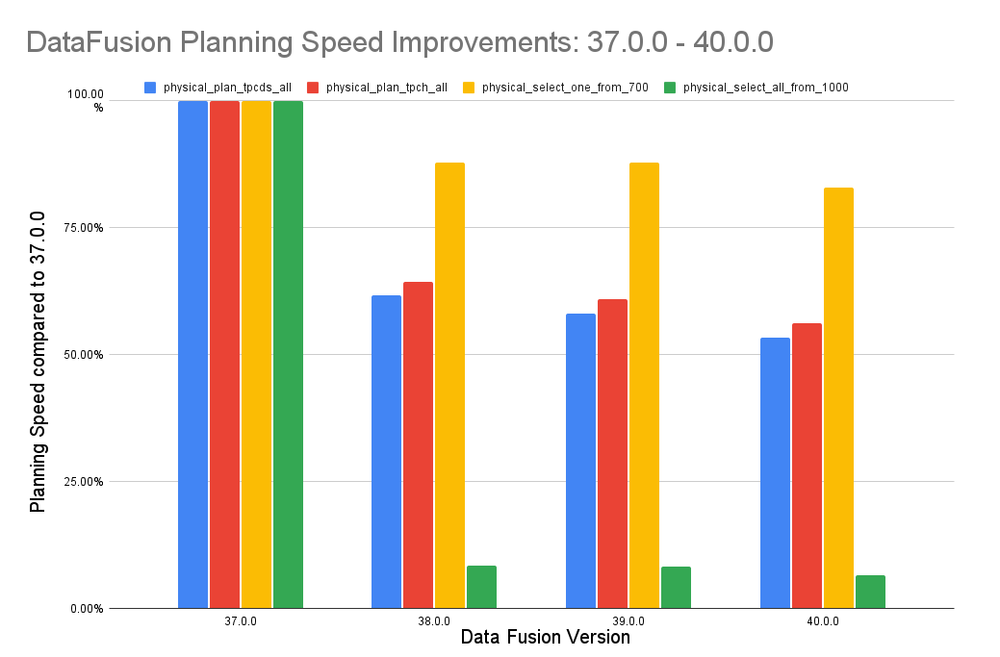

<!--

Licensed to the Apache Software Foundation (ASF) under one or more
contributor license agreements.  See the NOTICE file distributed with
this work for additional information regarding copyright ownership.
The ASF licenses this file to you under the Apache License, Version 2.0
(the "License"); you may not use this file except in compliance with
the License.  You may obtain a copy of the License at

http://www.apache.org/licenses/LICENSE-2.0

Unless required by applicable law or agreed to in writing, software
distributed under the License is distributed on an "AS IS" BASIS,
WITHOUT WARRANTIES OR CONDITIONS OF ANY KIND, either express or implied.
See the License for the specific language governing permissions and
limitations under the License.

-->

<!-- see https://github.com/apache/datafusion/issues/9602 for details -->

## Introduction

We are proud to announce [DataFusion 40.0.0]. This blog highlights some of the
many major improvements since we released [DataFusion 34.0.0] and a preview of
what the community is thinking about in the next 6 months. We are hoping to make
more regular blog posts -- if you are interested in helping write them, please
reach out!

[DataFusion 34.0.0]: https://datafusion.apache.org/blog/2024/01/19/datafusion-34.0.0/
[DataFusion 40.0.0]: https://crates.io/crates/datafusion/40.0.0

[Apache DataFusion] is an extensible query engine, written in [Rust], that
uses [Apache Arrow] as its in-memory format. DataFusion is used by developers to
create new, fast data centric systems such as databases, dataframe libraries,
machine learning and streaming applications. While [DataFusion’s primary design
goal] is to accelerate the creation of other data centric systems, it has a
reasonable experience directly out of the box as a [dataframe library] and
[command line SQL tool].

[DataFusion’s primary design goal]: https://datafusion.apache.org/user-guide/introduction.html#project-goals
[dataframe library]: https://datafusion.apache.org/python/
[command line SQL tool]: https://datafusion.apache.org/user-guide/cli/

[apache datafusion]: https://datafusion.apache.org/
[apache arrow]: https://arrow.apache.org
[rust]: https://www.rust-lang.org/

DataFusion's core thesis is that as a community, together we can build much more
advanced technology than any of us as individuals or companies could do alone. 
Without DataFusion, highly performant vectorized query engines would remain
the domain of a few large companies and world-class research institutions. 
With DataFusion, we can all build on top of a shared foundation, and focus on
what makes our projects unique.


## Community Growth  📈 

In the last 6 months, between `34.0.0` and `40.0.0`, our community continues to
grow in new and exciting ways.

1. DataFusion became a top level Apache Software Foundation project (read the
   [press release] and [blog post]).
2. We added several PMC members and new
   committers: [@comphead], [@mustafasrepo], [@ozankabak], and [@waynexia] joined the PMC,
   [@jonahgao] and [@lewiszlw] joined as committers. See the [mailing list] for
   more details.
3. [DataFusion Comet] was [donated] and is nearing its first release.
4. In the [core DataFusion repo] alone we reviewed and accepted almost 1500 PRs from 182 different
   committers, created over 1000 issues and closed 781 of them 🚀. This is up
   almost 50% from our last post (1000 PRs from 124 committers with 650 issues
   created in our last post) 🤯. All changes are listed in the detailed
   [CHANGELOG].
5. DataFusion focused meetups happened or are happening in multiple cities 
   around the world: [Austin], [San Francisco], [Hangzhou], [New York], and
   [Belgrade].
6. Many new projects started in the [datafusion-contrib] organization, including
   [Table Providers], [SQLancer], [Open Variant], [JSON], and [ORC].  

[core DataFusion repo]: https://github.com/apache/arrow-datafusion
[CHANGELOG]: https://github.com/apache/datafusion/blob/main/datafusion/CHANGELOG.md
[press release]: https://news.apache.org/foundation/entry/apache-software-foundation-announces-new-top-level-project-apache-datafusion
[blog post]: https://datafusion.apache.org/blog/2024/05/07/datafusion-tlp/
[mailing list]: https://lists.apache.org/list.html?dev@datafusion.apache.org
[Austin]: https://github.com/apache/datafusion/discussions/8522
[San Francisco]: https://github.com/apache/datafusion/discussions/10800
[Hangzhou]: https://www.huodongxing.com/event/5761971909400?td=1965290734055
[New York]: https://github.com/apache/datafusion/discussions/11213
[Belgrade]: https://github.com/apache/datafusion/discussions/11431
[datafusion-contrib]: https://github.com/datafusion-contrib
[Table Providers]: https://github.com/datafusion-contrib/datafusion-table-providers
[SQLancer]: https://github.com/datafusion-contrib/datafusion-sqlancer
[Open Variant]: https://github.com/datafusion-contrib/datafusion-functions-variant
[JSON]: https://github.com/datafusion-contrib/datafusion-functions-json
[ORC]: https://github.com/datafusion-contrib/datafusion-orc

<!--
$ git log --pretty=oneline 34.0.0..40.0.0 . | wc -l
     1453 (up from 1009)

$ git shortlog -sn 34.0.0..40.0.0 . | wc -l
      182 (up from 124)

https://crates.io/crates/datafusion/34.0.0
DataFusion 34 released Dec 17, 2023

https://crates.io/crates/datafusion/40.0.0
DataFusion 34 released July 12, 2024

Issues created in this time: 321 open, 781 closed (up from 214 open, 437 closed)
https://github.com/apache/arrow-datafusion/issues?q=is%3Aissue+created%3A2023-12-17..2024-07-12

Issues closed: 911 (up from 517)
https://github.com/apache/arrow-datafusion/issues?q=is%3Aissue+closed%3A2023-12-17..2024-07-12

PRs merged in this time 1490 (up from 908)
https://github.com/apache/arrow-datafusion/pulls?q=is%3Apr+merged%3A2023-12-17..2024-07-12

-->


In addition, DataFusion has been appearing publicly more and more, both online and offline. Here are some highlights:

1. [Apache Arrow DataFusion: A Fast, Embeddable, Modular Analytic Query Engine], was presented in [SIGMOD '24], one of the major database conferences
2. As part of the trend to define "the POSIX of databases" in ["What Goes Around Comes Around... And Around..."] from Andy Pavlo and Mike Stonebraker
3. ["Why you should keep an eye on Apache DataFusion and its community"]
4. [Apache DataFusion offline meetup in the Bay Area]


[DataFusion Comet]: https://datafusion.apache.org/comet/
[donated]: https://arrow.apache.org/blog/2024/03/06/comet-donation/
[SIGMOD '24]: https://2024.sigmod.org/


[Apache Arrow DataFusion: A Fast, Embeddable, Modular Analytic Query Engine]: https://dl.acm.org/doi/10.1145/3626246.3653368
["What Goes Around Comes Around... And Around..."]: https://db.cs.cmu.edu/papers/2024/whatgoesaround-sigmodrec2024.pdf
["Why you should keep an eye on Apache DataFusion and its community"]: https://www.cpard.xyz/posts/datafusion/
[Apache DataFusion offline meetup in the Bay Area]: https://www.tisonkun.org/2024/07/15/datafusion-meetup-san-francisco/


## Improved Performance 🚀 

Performance is a key feature of DataFusion, and the community continues to work
to keep DataFusion state of the art in this area. One major area DataFusion
improved is the time it takes to convert a SQL query into a plan that can be
executed. Planning is now almost 2x faster for TPC-DS and TPC-H queries, and
over 10x faster for some queries with many columns.

Here is a chart showing the improvement due to the concerted effort of many
contributors including [@jackwener], [@alamb], [@Lordworms], [@dmitrybugakov],
[@appletreeisyellow], [@ClSlaid], [@rohitrastogi], [@emgeee], [@kevinmingtarja],
and [@peter-toth] over several months (see [ticket] for more details)



[ticket]: https://github.com/apache/datafusion/issues/9637

DataFusion is now up to 40% faster for queries that `GROUP BY` a single string
or binary column due to a [specialization for single
Uft8/LargeUtf8/Binary/LargeBinary]. We are working on improving performance when
there are [multiple variable length columns in the `GROUP BY` clause].

[specialization for single Uft8/LargeUtf8/Binary/LargeBinary]: https://github.com/apache/datafusion/pull/8827

We are also in the final phases of [integrating] the new [Arrow StringView]
which significantly improves performance for workloads that scan, filter and
group by variable length string and binary data. We expect the improvement to be
especially pronounced for Parquet files due to [upstream work in the parquet
reader]. Kudos to [@XiangpengHong], [@AriesDevil], [@PsiACE], [@Weijun-H],
[@a10y], and [@RinChanNOWWW] for driving this project.

[integrating]: https://github.com/apache/datafusion/issues/10918
[Arrow StringView]: https://docs.rs/arrow/latest/arrow/array/struct.GenericByteViewArray.html
[multiple variable length columns in the `GROUP BY` clause]: https://github.com/apache/datafusion/issues/9403
[upstream work in the parquet reader]: https://github.com/apache/arrow-rs/issues/5530

## Improved Quality 📋

DataFusion continues to improve overall in quality. In addition to ongoing bug
fixes, one of the most exciting improvements is the addition of a new [SQLancer]
based [DataFusion Fuzzing] suite thanks to [@2010YOUY01] that has already found
several bugs and thanks to [@jonahgao], [@tshauck], [@xinlifoobar],
[@LorrensP-2158466] for fixing them so fast.

[DataFusion Fuzzing]: https://github.com/apache/datafusion/issues/11030


## Improved Documentation 📚

We continue to improve the documentation to make it easier to get started using DataFusion with
the [Library Users Guide], [API documentation], and [Examples].

Some notable new examples include:
* [sql_analysis.rs] to analyse SQL queries with DataFusion structures (thanks [@LorrensP-2158466])
* [function_factory.rs] to create custom functions via SQL (thanks [@milenkovicm])
* [plan_to_sql.rs] to generate SQL from DataFusion Expr and LogicalPlan (thanks [@edmondop])
* [parquet_index.rs] and [advanced_parquet_index.rs] for parquet indexing, described more below (thanks [@alamb])

[Library Users Guide]: https://datafusion.apache.org/library-user-guide/index.html
[API documentation]: https://docs.rs/datafusion/latest/datafusion/index.html
[Examples]: https://github.com/apache/datafusion/tree/main/datafusion-examples
[sql_analysis.rs]: https://github.com/apache/datafusion/blob/main/datafusion-examples/examples/sql_analysis.rs
[plan_to_sql.rs]: https://github.com/apache/datafusion/blob/main/datafusion-examples/examples/plan_to_sql.rs

## New Features ✨

There are too many new features in the last 6 months to list them all, but here
are some highlights:

# SQL 
* Support for `UNNEST` (thanks [@duongcongtoai], [@JasonLi-cn] and [@jayzhan211]) 
* Support for [Recursive CTEs] (thanks [@jonahgao] and [@matthewgapp]) 
* Support for `CREATE FUNCTION` (see below) 
* Many new SQL functions

[Recursive CTEs]: https://github.com/apache/datafusion/issues/462

DataFusion now has much improved support for structured types such `STRUCT`,
`LIST`/`ARRAY` and `MAP`. For example, you can now create `STRUCT` literals 
in SQL like this:

```rust
> select {'foo': {'bar': 2}};
+--------------------------------------------------------------+
| named_struct(Utf8("foo"),named_struct(Utf8("bar"),Int64(2))) |
+--------------------------------------------------------------+
| {foo: {bar: 2}}                                              |
+--------------------------------------------------------------+
1 row(s) fetched.
Elapsed 0.002 seconds.
```

# SQL Unparser (SQL Formatter)

DataFusion now supports converting `Expr`s and `LogicalPlan`s BACK to SQL text.
This can be useful in query federation to push predicates down into other
systems that only accept SQL, and for building systems that generate SQL.

For example, you can now convert a logical expression back to SQL text:

```rust
// Form a logical expression that represents the SQL "a < 5 OR a = 8"
let expr = col("a").lt(lit(5)).or(col("a").eq(lit(8)));
// convert the expression back to SQL text
let sql = expr_to_sql(&expr)?.to_string();
assert_eq!(sql, "a < 5 OR a = 8");
```

You can also do complex things like parsing SQL, modifying the plan, and convert
it back to SQL:

```rust
let df = ctx
  // Use SQL to read some data from the parquet file
  .sql("SELECT int_col, double_col, CAST(date_string_col as VARCHAR) FROM alltypes_plain")
  .await?;
// Programmatically add new filters `id > 1 and tinyint_col < double_col`
let df = df.filter(col("id").gt(lit(1)).and(col("tinyint_col").lt(col("double_col"))))?
// Convert the new logical plan back to SQL
let sql = plan_to_sql(df.logical_plan())?.to_string();
assert_eq!(sql, 
           "SELECT alltypes_plain.int_col, alltypes_plain.double_col, CAST(alltypes_plain.date_string_col AS VARCHAR) \
           FROM alltypes_plain WHERE ((alltypes_plain.id > 1) AND (alltypes_plain.tinyint_col < alltypes_plain.double_col))")
);
```

See the [Plan to SQL example] or the APIs [expr_to_sql] and [plan_to_sql] for more details.

[expr_to_sql]: https://docs.rs/datafusion/latest/datafusion/sql/unparser/fn.expr_to_sql.html
[plan_to_sql]: https://docs.rs/datafusion/latest/datafusion/sql/unparser/fn.plan_to_sql.html
[Plan to SQL example]: https://github.com/apache/datafusion/blob/main/datafusion-examples/examples/plan_to_sql.rs

# Low Level APIs for Fast Parquet Access (indexing)

With their rising prevalence, supporting efficient access to Parquet files
stored remotely on object storage is important. Part of doing this efficiently
is minimizing the number of object store requests made by caching metadata and
skipping over parts of the file that are not needed (e.g. via an index).

DataFusion's Parquet reader has long internally supported [advanced predicate
pushdown] by reading the parquet metadata from the file footer and pruning based
on row group and data page statistics. DataFusion now also supports users
supplying their own low level pruning information via the [`ParquetAccessPlan`]
API.

This API can be used along with index information to selectively skip decoding
parts of the file. For example, Spice AI used this feature to add [efficient
support] for reading from DeltaLake tables and handling [deletion vectors].

```text
        ┌───────────────────────┐   If the RowSelection does not include any
        │          ...          │   rows from a particular Data Page, that
        │                       │   Data Page is not fetched or decoded.
        │ ┌───────────────────┐ │   Note this requires a PageIndex
        │ │     ┌──────────┐  │ │
Row     │ │     │DataPage 0│  │ │                 ┌────────────────────┐
Groups  │ │     └──────────┘  │ │                 │                    │
        │ │     ┌──────────┐  │ │                 │    ParquetExec     │
        │ │ ... │DataPage 1│ ◀┼ ┼ ─ ─ ─           │  (Parquet Reader)  │
        │ │     └──────────┘  │ │      └ ─ ─ ─ ─ ─│                    │
        │ │     ┌──────────┐  │ │                 │ ╔═══════════════╗  │
        │ │     │DataPage 2│  │ │ If only rows    │ ║ParquetMetadata║  │
        │ │     └──────────┘  │ │ from DataPage 1 │ ╚═══════════════╝  │
        │ └───────────────────┘ │ are selected,   └────────────────────┘
        │                       │ only DataPage 1
        │          ...          │ is fetched and
        │                       │ decoded
        │ ╔═══════════════════╗ │
        │ ║  Thrift metadata  ║ │
        │ ╚═══════════════════╝ │
        └───────────────────────┘
         Parquet File
```

See the [parquet_index.rs] and [advanced_parquet_index.rs] examples for more details. 

Thanks to [@alamb] and [@Ted-Jiang] for this feature.  

[advanced predicate pushdown]: https://arrow.apache.org/blog/2022/12/26/querying-parquet-with-millisecond-latency/

[`ParquetAccessPlan`]: https://docs.rs/datafusion/latest/datafusion/datasource/physical_plan/parquet/struct.ParquetAccessPlan.html
[efficient support]: https://github.com/spiceai/spiceai/pull/1891
[deletion vectors]: https://docs.delta.io/latest/delta-deletion-vectors.html
[parquet_index.rs]: https://github.com/apache/datafusion/blob/main/datafusion-examples/examples/parquet_index.rs
[advanced_parquet_index.rs]: https://github.com/apache/datafusion/blob/main/datafusion-examples/examples/advanced_parquet_index.rs

## Building Systems is Easier with DataFusion 🛠️

In addition to many incremental API improvements, there are several new APIs that make
it easier to build systems on top of DataFusion:

* Faster and easier to use [TreeNode API] for traversing and manipulating plans and expressions.
* All functions now use the same [Scalar User Defined Function API], making it easier to customize
  DataFusion's behavior without sacrificing performance. See [ticket] for more details.
* DataFusion can now be compiled to [WASM]. 

[TreeNode API]: https://docs.rs/datafusion/latest/datafusion/common/tree_node/trait.TreeNode.html#overview
[Scalar User Defined Function API]: https://docs.rs/datafusion/latest/datafusion/logical_expr/trait.ScalarUDFImpl.html
[ticket]: https://github.com/apache/arrow-datafusion/issues/8045
[WASM]: https://github.com/apache/datafusion/discussions/9834

# User Defined SQL Parsing Extensions

As of DataFusion 40.0.0, you can use the [`ExprPlanner`] trait to extend
DataFusion's SQL planner to support custom operators or syntax.

For example the [datafusion-functions-json] project uses this API to support
JSON operators in SQL queries. It provides a custom implementation for
planning JSON operators such as `->` and `->>` with code like:

```rust
struct MyCustomPlanner;

impl ExprPlanner for MyCustomPlanner {
    // Provide custom implementation for planning a binary operators
    // such as `->` and `->>`
    fn plan_binary_op(
        &self,
        expr: RawBinaryExpr,
        _schema: &DFSchema,
    ) -> Result<PlannerResult<RawBinaryExpr>> {
        match &expr.op {
           BinaryOperator::Arrow => { /* plan -> operator */ }
           BinaryOperator::LongArrow => { /* plan ->> operator */ }
           ...
        }
    }
}
```

Thanks to [@samuelcolvin], [@jayzhan211] and [@dharanad] for helping make this
feature happen.

[datafusion-functions-json]: https://github.com/datafusion-contrib/datafusion-functions-json
[`ExprPlanner`]: https://docs.rs/datafusion/latest/datafusion/logical_expr/planner/trait.ExprPlanner.html

# Pluggable Support for `CREATE FUNCTION` 

DataFusion's new [`FunctionFactory`] API let's users provide a handler for
`CREATE FUNCTION` SQL statements. This feature lets you build systems that
support defining functions in SQL such as

```sql
-- SQL based functions
CREATE FUNCTION my_func(DOUBLE, DOUBLE) RETURNS DOUBLE
    RETURN $1 + $3
;

-- ML Models
CREATE FUNCTION iris(FLOAT[]) RETURNS FLOAT[] 
LANGUAGE TORCH AS 'models:/iris@champion';

-- WebAssembly
CREATE FUNCTION func(FLOAT[]) RETURNS FLOAT[] 
LANGUAGE WASM AS 'func.wasm'
```

Huge thanks to [@milenkovicm] for this feature. There is an example of how to
make macro like functions in [function_factory.rs]. It would be
great if [someone made a demo] showing how to create WASMs 🎣.

[function_factory.rs]: https://github.com/apache/datafusion/blob/main/datafusion-examples/examples/function_factory.rs
[someone made a demo]: https://github.com/apache/datafusion/issues/9326 

[`FunctionFactory`]: https://docs.rs/datafusion/latest/datafusion/execution/context/trait.FunctionFactory.html

## Looking Ahead: The Next Six Months 🔭 

The community has been [discussing what we will work on in the next six months].
Some major initiatives from that discussion are:

1. *Performance*: Improve the speed of [aggregating "high cardinality"]
  data when there are many (e.g. millions) of distinct groups as well as additional
  ideas to improve parquet performance. 

2. *Modularity*: Make DataFusion even more modular, by completely unifying
   built in and user [aggregate functions] and [window functions].

3. *LogicalTypes*: [Introduce Logical Types] to make it easier to use
   different encodings like `StringView`, `RunEnd` and `Dictionary` arrays as well
   as user defined types. Thanks [@notfilippo] for driving this. 

4. *Improved Documentation*: Write blog posts and videos explaining
   how to use DataFusion for real-world use cases.

5. *Testing*: Improve CI infrastructure and test coverage, more fuzz
   testing, and better functional and performance regression testing.


[discussing what we will work on in the next six months]: https://github.com/apache/datafusion/issues/11442
[aggregating "high cardinality"]: https://github.com/apache/arrow-datafusion/issues/7000
[Improved statistics handling]: https://github.com/apache/arrow-datafusion/issues/8227
[aggregate functions]: https://github.com/apache/datafusion/issues/8708
[window functions]: https://github.com/apache/datafusion/issues/8709
[Introduce Logical Types]: https://github.com/apache/datafusion/issues/11513

# How to Get Involved

DataFusion is not a project built or driven by a single person, company, or
foundation. Rather, our community of users and contributors work together to
build a shared technology that none of us could have built alone.

If you are interested in joining us we would love to have you. You can try out
DataFusion on some of your own data and projects and let us know how it goes,
contribute suggestions, documentation, bug reports, or a PR with documentation,
tests or code. A list of open issues suitable for beginners is [here] and you
can find how to reach us on the [communication doc].

[here]: https://github.com/apache/arrow-datafusion/issues?q=is%3Aissue+is%3Aopen+label%3A%22good+first+issue%22
[communication doc]: https://datafusion.apache.org/contributor-guide/communication.html

[@2010YOUY01]: https://github.com/2010YOUY01
[@comphead]: https://github.com/comphead
[@mustafasrepo]: https://github.com/mustafasrepo
[@ozankabak]: https://github.com/ozankabak
[@jonahgao]: https://github.com/jonahgao
[@lewiszlw]: https://github.com/lewiszlw
[@LorrensP-2158466]: https://github.com/LorrensP-2158466
[@edmondop]: https://github.com/edmondop
[@milenkovicm]: https://github.com/milenkovicm
[@jackwener]: https://github.com/jackwener
[@alamb]: https://github.com/alamb
[@Lordworms]: https://github.com/Lordworms
[@dmitrybugakov]: https://github.com/dmitrybugakov
[@appletreeisyellow]: https://github.com/appletreeisyellow
[@ClSlaid]: https://github.com/ClSlaid
[@rohitrastogi]: https://github.com/rohitrastogi
[@emgeee]: https://github.com/emgeee
[@kevinmingtarja]: https://github.com/kevinmingtarja
[@peter-toth]: https://github.com/peter-toth
[@duongcongtoai]: https://github.com/duongcongtoai
[@JasonLi-cn]: https://github.com/JasonLi-cn
[@samuelcolvin]: https://github.com/samuelcolvin
[@jayzhan211]: https://github.com/jayzhan211
[@dharanad]: https://github.com/dharanad
[@XiangpengHong]: https://github.com/XiangpengHong
[@AriesDevil]: https://github.com/AriesDevil
[@PsiACE]: https://github.com/PsiACE
[@Weijun-H]: https://github.com/Weijun-H
[@a10y]: https://github.com/a10y
[@RinChanNOWWW]: https://github.com/RinChanNOWWW
[@Ted-Jiang]: https://github.com/Ted-Jiang
[@xinlifoobar]: https://github.com/xinlifoobar
[@notfilippo]: https://github.com/notfilippo
[@tshauck]: https://github.com/tshauck
[@matthewgapp]: https://github.com/matthewgapp
[@waynexia]: https://github.com/waynexia

