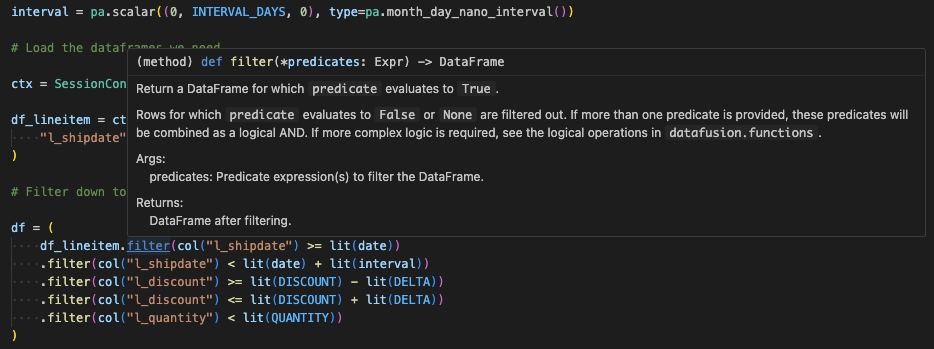
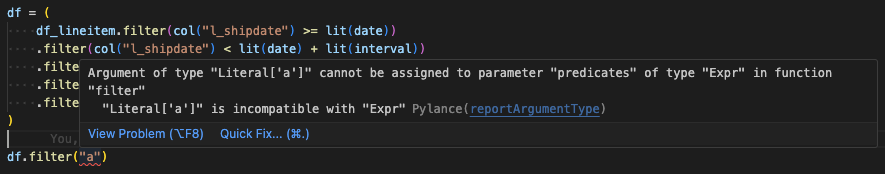

<!--

Licensed to the Apache Software Foundation (ASF) under one or more
contributor license agreements.  See the NOTICE file distributed with
this work for additional information regarding copyright ownership.
The ASF licenses this file to you under the Apache License, Version 2.0
(the "License"); you may not use this file except in compliance with
the License.  You may obtain a copy of the License at

http://www.apache.org/licenses/LICENSE-2.0

Unless required by applicable law or agreed to in writing, software
distributed under the License is distributed on an "AS IS" BASIS,
WITHOUT WARRANTIES OR CONDITIONS OF ANY KIND, either express or implied.
See the License for the specific language governing permissions and
limitations under the License.

-->

## Introduction

We are happy to announce that [DataFusion in Python 40.1.0] has been released. In addition to
bringing in all of the new features of the core [DataFusion 40.0.0] package, this release
contains *significant* updates to the user interface and documentation. We listened to the python
user community to create a more *pythonic* experience. If you have not used the python interface to
DataFusion before, this is an excellent time to give it a try!

[DataFusion 40.0.0]: https://datafusion.apache.org/blog/2024/07/24/datafusion-40.0.0/
[DataFusion in Python 40.1.0]: https://pypi.org/project/datafusion/40.1.0/

## Background

Until now, the python bindings for DataFusion have primarily been a thin layer to expose the
underlying Rust functionality. This has been worked well for early adopters to use DataFusion
within their Python projects, but some users have found it difficult to work with. As compared to
other DataFrame libraries, these issues were raised:

1. Most of the functions had little or no documentation. Users often had to refer to the Rust
documentation or code to learn how to use DataFusion. This alienated some python users.
2. Users could not take advantage of modern IDE features such as type hinting. These are valuable
tools for rapid testing and development.
3. Some of the interfaces felt “clunky” to users since some Python concepts do not always map well
to their Rust counterparts.

This release aims to bring a better user experience to the DataFusion Python community.

## What's Changed

The most significant difference is that we have added wrapper functions and classes for most of the
user facing interface. These wrappers, written in Python, contain both documentation and type
annotations.

This documenation is now available on the [DataFusion in Python API] website. There you can browse
the available functions and classes to see the breadth of available functionality.

Modern IDEs use language servers such as
[Pylance](https://marketplace.visualstudio.com/items?itemName=ms-python.vscode-pylance) or
[Jedi](https://jedi.readthedocs.io/en/latest/) to perform analysis of python code, provide useful
hints, and identify usage errors. These are major tools in the python user community. With this
release, users can fully use these tools in their workflow.

<figure style="text-align: center;">
  
  <figcaption>
   <b>Figure 1</b>: With the enhanced python wrappers, users can see helpful tool tips with
   type annotations directly in modern IDEs.
</figcaption>
</figure>

By having the type annotations, these IDEs can also identify quickly when a user has incorrectly
used a function's arguments as shown in Figure 2.

<figure style="text-align: center;">
  
  <figcaption>
   <b>Figure 2</b>: Modern Python language servers can perform static analysis and quickly find
   errors in the arguments to functions.
</figcaption>
</figure>

In addition to these wrapper libraries, we have enhancements to some of the functions to feel more
easy to use.

### Improved DataFrame filter arguments

You can now apply multiple `filter` statements in a single step. When using `DataFrame.filter` you
can pass in multiple arguments, separated by a comma. These will act as a logical `AND` of all of
the filter arguments. The following two statements are equivalent:

```python
df.filter(col("size") < col("max_size")).filter(col("color") == lit("green"))
df.filter(col("size") < col("max_size"), col("color") == lit("green"))
```

### Comparison against literal values

It is very common to write DataFrame operations that compare an expression to some fixed value.
For example, filtering a DataFrame might have an operation such as `df.filter(col("size") < lit(16))`.
To make these common operations more ergonomic, you can now simply use `df.filter(col("size") < 16)`.

For the right hand side of the comparison operator, you can now use any Python value that can be
coerced into a `Literal`. This gives an easy to ready expression. For example, consider these few
lines from one of the
[TPC-H examples](https://github.com/apache/datafusion-python/tree/main/examples/tpch) provided in
the DataFusion Python repository.

```python
df = (
    df_lineitem.filter(col("l_shipdate") >= lit(date))
    .filter(col("l_discount") >= lit(DISCOUNT) - lit(DELTA))
    .filter(col("l_discount") <= lit(DISCOUNT) + lit(DELTA))
    .filter(col("l_quantity") < lit(QUANTITY))
)
```

The above code mirrors closely how these filters would need to be applied in rust. With this new
release, the user can simplify these lines. Also shown in the example below is that `filter()`
now accepts a variable number of arguments and filters on all such arguments (boolean AND).

```python
df = df_lineitem.filter(
    col("l_shipdate") >= date,
    col("l_discount") >= DISCOUNT - DELTA,
    col("l_discount") <= DISCOUNT + DELTA,
    col("l_quantity") < QUANTITY,
)
```

### Select columns by name

It is very common for users to perform `DataFrame` selection where they simply want a column. For
this we have had the function `select_columns("a", "b")` or the user could perform
`select(col("a"), col("b"))`. In the new release, we accept either full expressions in `select()`
or strings of the column names. You can mix these as well.

Where before you may have to do an operation like

```python
df_subset = df.select(col("a"), col("b"), f.abs(col("c")))
```

You can now simplify this to

```python
df_subset = df.select("a", "b", f.abs(col("c")))
```

### Creating named structs

Creating a `struct` with named fields was previously difficult to use and allowed for potential
user errors when specifying the name of each field. Now we have a cleaner interface where the
user passes a list of tuples containing the name of the field and the expression to create.

```python
df.select(f.named_struct([
  ("a", col("a")),
  ("b", col("b"))
]))
```

## Next Steps

While most of the user facing classes and functions have been exposed, there are a few that require
exposure. Namely the classes in `datafusion.object_store` and the logical plans used by
`datafusion.substrait`. The team is working on
[these issues](https://github.com/apache/datafusion-python/issues/767).

Additionally, in the next release of DataFusion there have been improvements made to the user-defined
aggregate and window functions to make them easier to use. We plan on
[bringing these enhancements](https://github.com/apache/datafusion-python/issues/780) to this project.

## Thank You

We would like to thank the following members for their very helpful discussions regarding these
updates: [@andygrove], [@max-muoto], [@slyons], [@Throne3d], [@Michael-J-Ward], [@datapythonista],
[@austin362667], [@kylebarron], [@simicd]. The [primary PR (#750)] that includes these updates
had an extensive conversation, leading to a significantly improved end product. Again, thank you
to all who provided input!

We would like to give an special thank you to [@3ok] who created the initial version of the wrapper
definitions. The work they did was time consuming and required exceptional attention to detail. It
provided enormous value to starting this project. Thank you!

## Get Involved

The DataFusion Python team is an active and engaging community and we would love
to have you join us and help the project.

Here are some ways to get involved:

* Learn more by visiting the [DataFusion Python project](https://datafusion.apache.org/python/index.html)
page.

* Try out the project and provide feedback, file issues, and contribute code.

[mailing list]: https://lists.apache.org/list.html?dev@datafusion.apache.org
[DataFusion in Python API]: https://datafusion.apache.org/python/autoapi/datafusion/index.html
[@andygrove]: https://github.com/andygrove
[@max-muoto]: https://github.com/max-muoto
[@slyons]: https://github.com/slyons
[@Throne3d]: https://github.com/Throne3d
[@Michael-J-Ward]: https://github.com/Michael-J-Ward
[@datapythonista]: https://github.com/datapythonista
[@austin362667]: https://github.com/austin362667
[@kylebarron]: https://github.com/kylebarron
[@simicd]: https://github.com/simicd
[@3ok]: https://github.com/3ok
[primary PR (#750)]: https://github.com/apache/datafusion-python/pull/750
