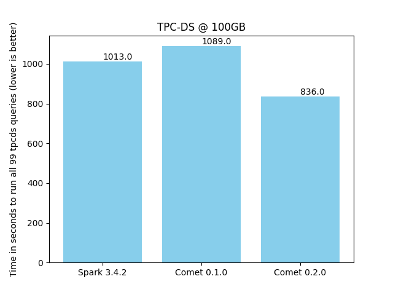

<!--

Licensed to the Apache Software Foundation (ASF) under one or more
contributor license agreements.  See the NOTICE file distributed with
this work for additional information regarding copyright ownership.
The ASF licenses this file to you under the Apache License, Version 2.0
(the "License"); you may not use this file except in compliance with
the License.  You may obtain a copy of the License at

http://www.apache.org/licenses/LICENSE-2.0

Unless required by applicable law or agreed to in writing, software
distributed under the License is distributed on an "AS IS" BASIS,
WITHOUT WARRANTIES OR CONDITIONS OF ANY KIND, either express or implied.
See the License for the specific language governing permissions and
limitations under the License.

-->

The Apache DataFusion PMC is pleased to announce version 0.2.0 of the [Comet](https://datafusion.apache.org/comet/) subproject.

Comet is an accelerator for Apache Spark that translates Spark physical plans to DataFusion physical plans for
improved performance and efficiency without requiring any code changes.

Comet runs on commodity hardware and aims to provide 100% compatibility with Apache Spark. Any operators or
expressions that are not fully compatible will fall back to Spark unless explicitly enabled by the user. Refer
to the [compatibility guide] for more information.

[compatibility guide]: https://datafusion.apache.org/comet/user-guide/compatibility.html

This release covers approximately four weeks of development work and is the result of merging 87 PRs from 14 
contributors. See the [change log] for more information.

[change log]: https://github.com/apache/datafusion-comet/blob/main/dev/changelog/0.2.0.md

## Release Highlights

### Docker Images

Docker images are now available from the [GitHub Container Registry].

[GitHub Container Registry]: https://github.com/apache/datafusion-comet/pkgs/container/datafusion-comet/265110454?tag=spark-3.4-scala-2.12-0.2.0

### Performance improvements

- Native shuffle is now enabled by default
- Improved handling of decimal types
- Reduced some redundant copying of batches in Filter/Scan operations
- Optimized performance of count aggregates
- Optimized performance of  CASE expressions for specific uses:
  - CASE WHEN expr THEN column ELSE null END
  - CASE WHEN expr THEN literal ELSE literal END
- Optimized performance of IS NOT NULL

### New Features

- Window operations now support count and sum aggregates
- CreateArray
- GetStructField
- Support nested types in hash join
- Basic implementation of RLIKE expression

## Current Performance

We use benchmarks derived from the industry standard TPC-H and TPC-DS benchmarks for tracking progress with
performance. The following charts shows the time it takes to run the queries against 100 GB of data in
Parquet format using a single executor with eight cores. See the [Comet Benchmarking Guide]
for details of the environment used for these benchmarks.

[Comet Benchmarking Guide]: https://datafusion.apache.org/comet/contributor-guide/benchmarking.html

### Benchmark derived from TPC-H

Comet 0.2.0 provides a 62% speedup compared to Spark. This is slightly better than the Comet 0.1.0 release.

### Benchmark derived from TPC-DS

Comet 0.2.0 provides a 21% speedup compared to Spark, which is a significant improvement compared to 
Comet 0.1.0, which did not provide any speedup for this benchmark.

## Getting Involved

The Comet project welcomes new contributors. We use the same [Slack and Discord] channels as the main DataFusion
project.

[Slack and Discord]: https://datafusion.apache.org/contributor-guide/communication.html#slack-and-discord

The easiest way to get involved is to test Comet with your current Spark jobs and file issues for any bugs or
performance regressions that you find. See the [Getting Started] guide for instructions on downloading and installing
Comet.

[Getting Started]: https://datafusion.apache.org/comet/user-guide/installation.html

There are also many [good first issues] waiting for contributions.

[good first issues]: https://github.com/apache/datafusion-comet/contribute
