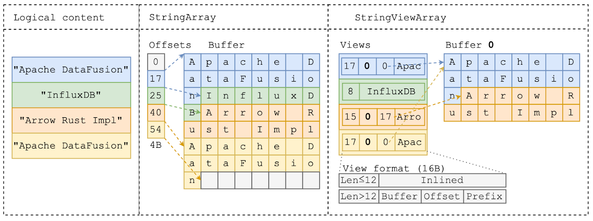
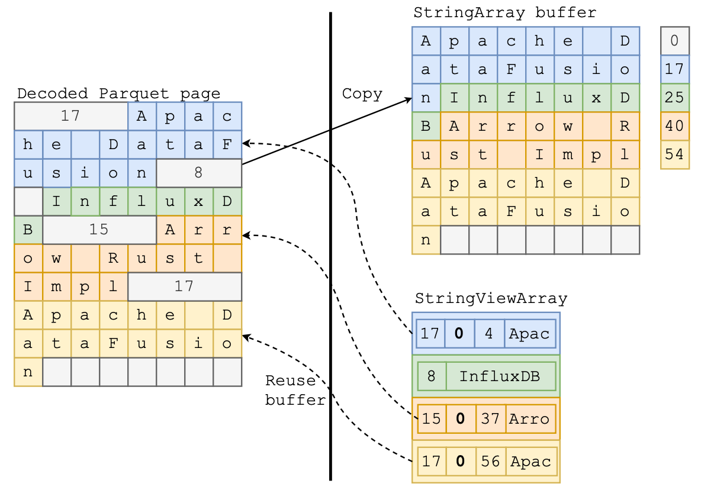
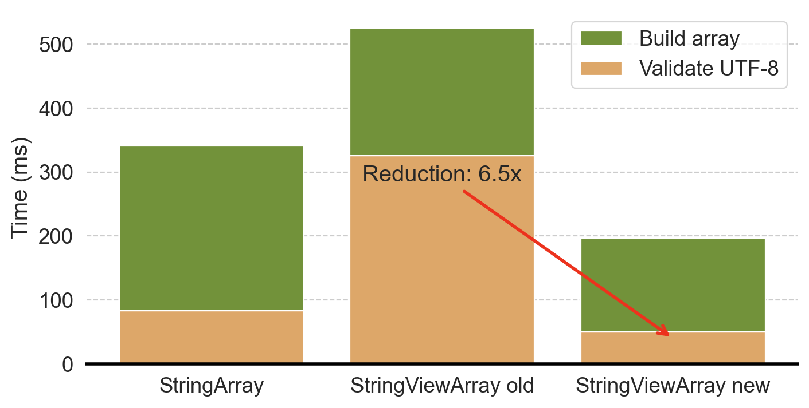
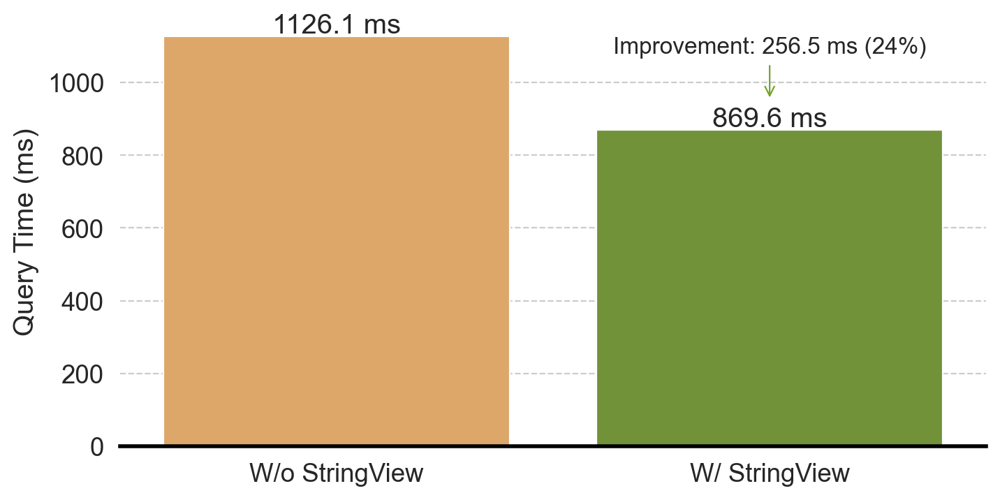

<!--

Licensed to the Apache Software Foundation (ASF) under one or more
contributor license agreements.  See the NOTICE file distributed with
this work for additional information regarding copyright ownership.
The ASF licenses this file to you under the Apache License, Version 2.0
(the "License"); you may not use this file except in compliance with
the License.  You may obtain a copy of the License at

http://www.apache.org/licenses/LICENSE-2.0

Unless required by applicable law or agreed to in writing, software
distributed under the License is distributed on an "AS IS" BASIS,
WITHOUT WARRANTIES OR CONDITIONS OF ANY KIND, either express or implied.
See the License for the specific language governing permissions and
limitations under the License.

-->

_Editor's Note: This is the first of a [two part] blog series that was first published on the [InfluxData blog]. Thanks to InfluxData for sponsoring this work as [Xiangpeng Hao]'s summer intern project_

This blog describes our experience implementing [StringView](https://arrow.apache.org/docs/format/Columnar.html#variable-size-binary-view-layout) in the [Rust implementation](https://github.com/apache/arrow-rs) of [Apache Arrow](https://arrow.apache.org/), and integrating it into [Apache DataFusion](https://datafusion.apache.org/), significantly accelerating string-intensive queries in the [ClickBench](https://benchmark.clickhouse.com/) benchmark by 20%- 200% (Figure 1[^1]).

Getting significant end-to-end performance improvements was non-trivial. Implementing StringView itself was only a fraction of the effort required. Among other things, we had to optimize UTF-8 validation, implement unintuitive compiler optimizations, tune block sizes, and time GC to realize the [FDAP ecosystem](https://www.influxdata.com/blog/flight-datafusion-arrow-parquet-fdap-architecture-influxdb/)’s benefit. With other members of the open source community, we were able to overcome performance bottlenecks that could have killed the project. We would like to contribute by explaining the challenges and solutions in more detail so that more of the community can learn from our experience.

StringView is based on a simple idea: avoid some string copies and accelerate comparisons with inlined prefixes. Like most great ideas, it is “obvious” only after [someone describes it clearly](https://db.in.tum.de/~freitag/papers/p29-neumann-cidr20.pdf). Although simple, straightforward implementation actually _slows down performance for almost every query_. We must, therefore, apply astute observations and diligent engineering to realize the actual benefits from StringView.

Although this journey was successful, not all research ideas are as lucky. To accelerate the adoption of research into industry, it is valuable to integrate research prototypes with practical systems. Understanding the nuances of real-world systems makes it more likely that research designs[^2] will lead to practical system improvements.

StringView support was released as part of [arrow-rs v52.2.0](https://crates.io/crates/arrow/52.2.0) and [DataFusion v41.0.0](https://crates.io/crates/datafusion/41.0.0). You can try it by setting the `schema_force_view_types` [DataFusion configuration option](https://datafusion.apache.org/user-guide/configs.html), and we are[ hard at work with the community to ](https://github.com/apache/datafusion/issues/11682)make it the default. We invite everyone to try it out, take advantage of the effort invested so far, and contribute to making it better.

[Xiangpeng Hao]: https://haoxp.xyz/
[InfluxData blog]: https://www.influxdata.com/blog/faster-queries-with-stringview-part-one-influxdb/
[two part]: ../2024/09/13/string-view-german-style-strings-part-2/

Figure 1: StringView improves string-intensive ClickBench query performance by 20% - 200%

## What is StringView?

Figure 2: Use StringArray and StringViewArray to represent the same string content.

The concept of inlined strings with prefixes (called “German Strings” [by Andy Pavlo](https://x.com/andy_pavlo/status/1813258735965643203), in homage to [TUM](https://www.tum.de/), where the [Umbra paper that describes](https://db.in.tum.de/~freitag/papers/p29-neumann-cidr20.pdf) them originated) 
has been used in many recent database systems ([Velox](https://engineering.fb.com/2024/02/20/developer-tools/velox-apache-arrow-15-composable-data-management/), [Polars](https://pola.rs/posts/polars-string-type/), [DuckDB](https://duckdb.org/2021/12/03/duck-arrow.html), [CedarDB](https://cedardb.com/blog/german_strings/), etc.) 
and was introduced to Arrow as a new [StringViewArray](https://arrow.apache.org/docs/format/Columnar.html#variable-size-binary-view-layout)[^3] type. Arrow’s original [StringArray](https://arrow.apache.org/docs/format/Columnar.html#variable-size-binary-layout) is very memory efficient but less effective for certain operations. 
StringViewArray accelerates string-intensive operations via prefix inlining and a more flexible and compact string representation.

A StringViewArray consists of three components:

1. The <code><em>view</em></code> array
2. The buffers
3. The buffer pointers (IDs) that map buffer offsets to their physical locations

Each <code>view</code> is 16 bytes long, and its contents differ based on the string’s length:

* string length &lt; 12 bytes: the first four bytes store the string length, and the remaining 12 bytes store the inlined string.
* string length > 12 bytes: the string is stored in a separate buffer. The length is again stored in the first 4 bytes, followed by the buffer id (4 bytes), the buffer offset (4 bytes), and the prefix (first 4 bytes) of the string.

Figure 2 shows an example of the same logical content (left) using StringArray (middle) and StringViewArray (right):

* The first string – `"Apache DataFusion"` – is 17 bytes long, and both StringArray and StringViewArray store the string’s bytes at the beginning of the buffer. The StringViewArray also inlines the first 4 bytes – `"Apac"` – in the view.
* The second string, `"InfluxDB"` is only 8 bytes long, so StringViewArray completely inlines the string content in the `view` struct while StringArray stores the string in the buffer as well.
* The third string `"Arrow Rust Impl"` is 15 bytes long and cannot be fully inlined. StringViewArray stores this in the same form as the first string.
* The last string `"Apache DataFusion"` has the same content as the first string. It’s possible to use StringViewArray to avoid this duplication and reuse the bytes by pointing the view to the previous location.

StringViewArray provides three opportunities for outperforming StringArray:

1. Less copying via the offset + buffer format
2. Faster comparisons using the inlined string prefix
3. Reusing repeated string values with the flexible `view` layout

The rest of this blog post discusses how to apply these opportunities in real query scenarios to improve performance, what challenges we encountered along the way, and how we solved them.

## Faster Parquet Loading

[Apache Parquet](https://parquet.apache.org/) is the de facto format for storing large-scale analytical data commonly stored LakeHouse-style, such as [Apache Iceberg](https://iceberg.apache.org) and [Delta Lake](https://delta.io). Efficiently loading data from Parquet is thus critical to query performance in many important real-world workloads.

Parquet encodes strings (i.e., [byte array](https://docs.rs/parquet/latest/parquet/data_type/struct.ByteArray.html)) in a slightly different format than required for the original Arrow StringArray. The string length is encoded inline with the actual string data (as shown in Figure 4 left). As mentioned previously, StringArray requires the data buffer to be continuous and compact—the strings have to follow one after another. This requirement means that reading Parquet string data into an Arrow StringArray requires copying and consolidating the string bytes to a new buffer and tracking offsets in a separate array. Copying these strings is often wasteful. Typical queries filter out most data immediately after loading, so most of the copied data is quickly discarded.

On the other hand, reading Parquet data as a StringViewArray can re-use the same data buffer as storing the Parquet pages because StringViewArray does not require strings to be contiguous. For example, in Figure 4, the StringViewArray directly references the buffer with the decoded Parquet page. The string `"Arrow Rust Impl"` is represented by a `view` with offset 37 and length 15 into that buffer.

Figure 4: StringViewArray avoids copying by reusing decoded Parquet pages.

**Mini benchmark**

Reusing Parquet buffers is great in theory, but how much does saving a copy actually matter? We can run the following benchmark in arrow-rs to find out:

Our benchmarking machine shows that loading _BinaryViewArray_ is almost 2x faster than loading BinaryArray (see next section about why this isn’t _String_ ViewArray).

You can read more on this arrow-rs issue: [https://github.com/apache/arrow-rs/issues/5904](https://github.com/apache/arrow-rs/issues/5904)

# From Binary to Strings

You may wonder why we reported performance for BinaryViewArray when this post is about StringViewArray. Surprisingly, initially, our implementation to read StringViewArray from Parquet was much _slower_ than StringArray. Why? TLDR: Although reading StringViewArray copied less data, the initial implementation also spent much more time validating [UTF-8](https://en.wikipedia.org/wiki/UTF-8#:~:text=UTF%2D8%20is%20a%20variable,Unicode%20Standard) (as shown in Figure 5).

Strings are stored as byte sequences. When reading data from (potentially untrusted) Parquet files, a Parquet decoder must ensure those byte sequences are valid UTF-8 strings, and most programming languages, including Rust, include highly[ optimized routines](https://doc.rust-lang.org/std/str/fn.from_utf8.html) for doing so.

Figure 5: Time to load strings from Parquet. The UTF-8 validation advantage initially eliminates the advantage of reduced copying for StringViewArray.

A StringArray can be validated in a single call to the UTF-8 validation function as it has a continuous string buffer. As long as the underlying buffer is UTF-8[^4], all strings in the array must be UTF-8. The Rust parquet reader makes a single function call to validate the entire buffer.

However, validating an arbitrary StringViewArray requires validating each string with a separate call to the validation function, as the underlying buffer may also contain non-string data (for example, the lengths in Parquet pages).

UTF-8 validation in Rust is highly optimized and favors longer strings (as shown in Figure 6), likely because it leverages SIMD instructions to perform parallel validation. The benefit of a single function call to validate UTF-8 over a function call for each string more than eliminates the advantage of avoiding the copy for StringViewArray.

Figure 6: UTF-8 validation throughput vs string length—StringArray’s contiguous buffer can be validated much faster than StringViewArray’s buffer.

Does this mean we should only use StringArray? No! Thankfully, there’s a clever way out. The key observation is that in many real-world datasets,[ 99% of strings are shorter than 128 bytes](https://www.vldb.org/pvldb/vol17/p148-zeng.pdf), meaning the encoded length values are smaller than 128, **in which case the length itself is also valid UTF-8** (in fact, it is [ASCII](https://en.wikipedia.org/wiki/ASCII)).

This observation means we can optimize validating UTF-8 strings in Parquet pages by treating the length bytes as part of a single large string as long as the length _value_ is less than 128. Put another way, prior to this optimization, the length bytes act as string boundaries, which require a UTF-8 validation on each string. After this optimization, only those strings with lengths larger than 128 bytes (less than 1% of the strings in the ClickBench dataset) are string boundaries, significantly increasing the UTF-8 validation chunk size and thus improving performance.

The [actual implementation](https://github.com/apache/arrow-rs/pull/6009/files) is only nine lines of Rust (with 30 lines of comments). You can find more details in the related arrow-rs issue:[ https://github.com/apache/arrow-rs/issues/5995](https://github.com/apache/arrow-rs/issues/5995). As expected, with this optimization, loading StringViewArray is almost 2x faster than loading StringArray.

# Be Careful About Implicit Copies

After all the work to avoid copying strings when loading from Parquet, performance was still not as good as expected. We tracked the problem to a few implicit data copies that we weren't aware of, as described in[ this issue](https://github.com/apache/arrow-rs/issues/6033).

The copies we eventually identified come from the following innocent-looking line of Rust code, where `self.buf` is a [reference counted](https://en.wikipedia.org/wiki/Reference_counting) pointer that should transform without copying into a buffer for use in StringViewArray.

However, Rust-type coercion rules favored a blanket implementation that _did_ copy data. This implementation is shown in the following code block where the `impl<T: AsRef<[u8]>>` will accept any type that implements `AsRef<[u8]>` and copies the data to create a new buffer. To avoid copying, users need to explicitly call `from_vec`, which consumes the `Vec` and transforms it into a buffer.

Diagnosing this implicit copy was time-consuming as it relied on subtle Rust language semantics. We needed to track every step of the data flow to ensure every copy was necessary. To help other users and prevent future mistakes, we also [removed](https://github.com/apache/arrow-rs/pull/6043) the implicit API from arrow-rs in favor of an explicit API. Using this approach, we found and fixed several [other unintentional copies](https://github.com/apache/arrow-rs/pull/6039) in the code base—hopefully, the change will help other [downstream users](https://github.com/spiraldb/vortex/pull/504) avoid unnecessary copies.

# Help the Compiler by Giving it More Information

The Rust compiler’s automatic optimizations mostly work very well for a wide variety of use cases, but sometimes, it needs additional hints to generate the most efficient code. When profiling the performance of `view` construction, we found, counterintuitively, that constructing **long** strings was 10x faster than constructing **short** strings, which made short strings slower on StringViewArray than on StringArray!

As described in the first section, StringViewArray treats long and short strings differently. Short strings (&lt;12 bytes) directly inline to the `view` struct, while long strings only inline the first 4 bytes. The code to construct a `view` looks something like this:

It appears that both branches of the code should be fast: they both involve copying at most 16 bytes of data and some memory shift/store operations. How could the branch for short strings be 10x slower?

Looking at the assembly code using [Compiler Explorer](https://godbolt.org/), we (with help from [Ao Li](https://github.com/aoli-al)) found the compiler used CPU **load instructions** to copy the fixed-sized 4 bytes to the `view` for long strings, but it calls a function, [`ptr::copy_non_overlapping`](https://doc.rust-lang.org/std/ptr/fn.copy_nonoverlapping.html), to copy the inlined bytes to the <code>view</code> for short strings. The difference is that long strings have a prefix size (4 bytes) known at compile time, so the compiler directly uses efficient CPU instructions. But, since the size of the short string is unknown to the compiler, it has to call the general-purpose function <code>ptr::copy_non_coverlapping</code>. Making a function call is significant unnecessary overhead compared to a CPU copy instruction.

However, we know something the compiler doesn’t know: the short string size is not arbitrary—it must be between 0 and 12 bytes, and we can leverage this information to avoid the function call. Our solution generates 13 copies of the function using generics, one for each of the possible prefix lengths. The code looks as follows, and [checking the assembly code](https://godbolt.org/z/685YPsd5G), we confirmed there are no calls to `ptr::copy_non_overlapping`, and only native CPU instructions are used. For more details, see [the ticket](https://github.com/apache/arrow-rs/issues/6034).

# End-to-End Query Performance

In the previous sections, we went out of our way to make sure loading StringViewArray is faster than StringArray. Before going further, we wanted to verify if obsessing about reducing copies and function calls has actually improved end-to-end performance in real-life queries. To do this, we evaluated a ClickBench query (Q20) in DataFusion that counts how many URLs contain the word `"google"`:

This is a relatively simple query; most of the time is spent on loading the “URL” column to find matching rows. The query plan looks like this:

We ran the benchmark in the DataFusion repo like this:

With StringViewArray we saw a 24% end-to-end performance improvement, as shown in Figure 7. With the `--string-view` argument, the end-to-end query time is `944.3 ms, 869.6 ms, 861.9 ms` (three iterations). Without `--string-view`, the end-to-end query time is `1186.1 ms, 1126.1 ms, 1138.3 ms`.

Figure 7: StringView reduces end-to-end query time by 24% on ClickBench Q20.

We also double-checked with detailed profiling and verified that the time reduction is indeed due to faster Parquet loading.

## Conclusion

In this first blog post, we have described what it took to improve the
performance of simply reading strings from Parquet files using StringView. While
this resulted in real end-to-end query performance improvements, in our [next
post], we explore additional optimizations enabled by StringView in DataFusion,
along with some of the pitfalls we encountered while implementing them.

[next post]: https://datafusion.apache.org/blog/2024/09/13/using-stringview-to-make-queries-faster-part-2.html

# Footnotes

[^1]: Benchmarked with AMD Ryzen 7600x (12 core, 24 threads, 32 MiB L3), WD Black SN770 NVMe SSD (5150MB/4950MB seq RW bandwidth)

[^2]: Xiangpeng is a PhD student at the University of Wisconsin-Madison

[^3]: There is also a corresponding _BinaryViewArray_ which is similar except that the data is not constrained to be UTF-8 encoded strings.

[^4]: We also make sure that offsets do not break a UTF-8 code point, which is [cheaply validated](https://github.com/apache/arrow-rs/blob/master/parquet/src/arrow/buffer/offset_buffer.rs#L62-L71).
