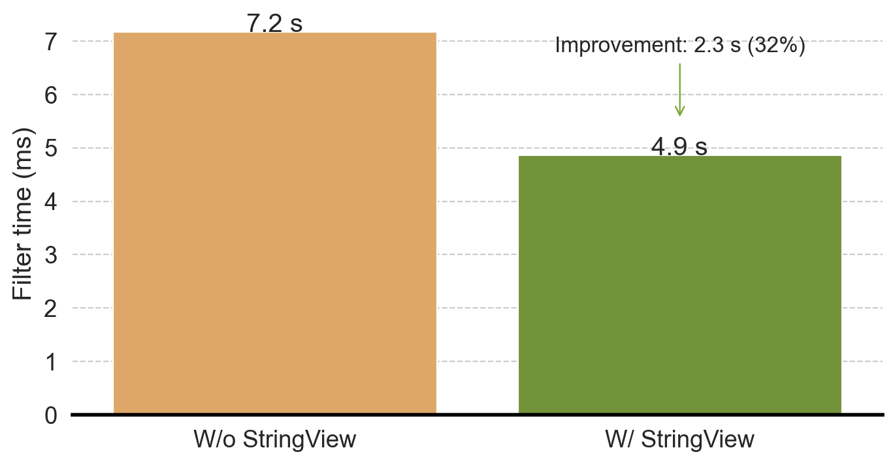

<!--

Licensed to the Apache Software Foundation (ASF) under one or more
contributor license agreements.  See the NOTICE file distributed with
this work for additional information regarding copyright ownership.
The ASF licenses this file to you under the Apache License, Version 2.0
(the "License"); you may not use this file except in compliance with
the License.  You may obtain a copy of the License at

http://www.apache.org/licenses/LICENSE-2.0

Unless required by applicable law or agreed to in writing, software
distributed under the License is distributed on an "AS IS" BASIS,
WITHOUT WARRANTIES OR CONDITIONS OF ANY KIND, either express or implied.
See the License for the specific language governing permissions and
limitations under the License.

-->

_Editor's Note: This blog series was first published on the [InfluxData blog]. Thanks to InfluxData for sponsoring this work as [Xiangpeng Hao]'s summer intern project_

In the [first post], we discussed the nuances required to accelerate Parquet loading using StringViewArray by reusing buffers and reducing copies. 
In this second part of the post, we describe the rest of the journey: implementing additional efficient operations for real query processing.

[Xiangpeng Hao]: https://haoxp.xyz/
[InfluxData blog]: https://www.influxdata.com/blog/faster-queries-with-stringview-part-two-influxdb/
[first post]: {filename}./2024-09-13-string-view-german-style-strings-part-1.md

## Faster String Operations

# Faster comparison

String comparison is ubiquitous; it is the core of 
[`cmp`](https://docs.rs/arrow/latest/arrow/compute/kernels/cmp/index.html), 
[`min`](https://docs.rs/arrow/latest/arrow/compute/fn.min.html)/[`max`](https://docs.rs/arrow/latest/arrow/compute/fn.max.html), 
and [`like`](https://docs.rs/arrow/latest/arrow/compute/kernels/comparison/fn.like.html)/[`ilike`](https://docs.rs/arrow/latest/arrow/compute/kernels/comparison/fn.ilike.html) kernels. StringViewArray is designed to accelerate such comparisons using the inlined prefix—the key observation is that, in many cases, only the first few bytes of the string determine the string comparison results.

For example, to compare the strings `InfluxDB` with `Apache DataFusion`, we only need to look at the first byte to determine the string ordering or equality. In this case, since `A` is earlier in the alphabet than `I,` `Apache DataFusion` sorts first, and we know the strings are not equal. Despite only needing the first byte, comparing these strings when stored as a StringArray requires two memory accesses: 1) load the string offset and 2) use the offset to locate the string bytes. For low-level operations such as `cmp` that are invoked millions of times in the very hot paths of queries, avoiding this extra memory access can make a measurable difference in query performance.

For StringViewArray, typically, only one memory access is needed to load the view struct. Only if the result can not be determined from the prefix is the second memory access required. For the example above, there is no need for the second access. This technique is very effective in practice: the second access is never necessary for the more than [60% of real-world strings which are shorter than 12 bytes](https://www.vldb.org/pvldb/vol17/p148-zeng.pdf), as they are stored completely in the prefix.

However, functions that operate on strings must be specialized to take advantage of the inlined prefix. In addition to low-level comparison kernels, we implemented [a wide range](https://github.com/apache/arrow-rs/issues/5374) of other StringViewArray operations that cover the functions and operations seen in ClickBench queries. Supporting StringViewArray in all string operations takes quite a bit of effort, and thankfully the Arrow and DataFusion communities are already hard at work doing so (see [https://github.com/apache/datafusion/issues/11752](https://github.com/apache/datafusion/issues/11752) if you want to help out).

# Faster `take `and` filter`

After a filter operation such as `WHERE url <> ''` to avoid processing empty urls, DataFusion will often _coalesce_ results to form a new array with only the passing elements. 
This coalescing ensures the batches are sufficiently sized to benefit from [vectorized processing](https://www.vldb.org/pvldb/vol11/p2209-kersten.pdf) in subsequent steps.

The coalescing operation is implemented using the [take](https://docs.rs/arrow/latest/arrow/compute/fn.take.html) and [filter](https://arrow.apache.org/rust/arrow/compute/kernels/filter/fn.filter.html) kernels in arrow-rs. For StringArray, these kernels require copying the string contents to a new buffer without “holes” in between. This copy can be expensive especially when the new array is large.

However, `take` and `filter` for StringViewArray can avoid the copy by reusing buffers from the old array. The kernels only need to create a new list of  `view`s that point at the same strings within the old buffers. 
Figure 1 illustrates the difference between the output of both string representations. StringArray creates two new strings at offsets 0-17 and 17-32, while StringViewArray simply points to the original buffer at offsets 0 and 25.

Figure 1: Zero-copy `take`/`filter` for StringViewArray

# When to GC?

Zero-copy `take/filter` is great for generating large arrays quickly, but it is suboptimal for highly selective filters, where most of the strings are filtered out. When the cardinality drops, StringViewArray buffers become sparse—only a small subset of the bytes in the buffer’s memory are referred to by any `view`. This leads to excessive memory usage, especially in a [filter-then-coalesce scenario](https://github.com/apache/datafusion/issues/11628). For example, a StringViewArray with 10M strings may only refer to 1M strings after some filter operations; however, due to zero-copy take/filter, the (reused) 10M buffers can not be released/reused.

To release unused memory, we implemented a [garbage collection (GC)](https://docs.rs/arrow/latest/arrow/array/struct.GenericByteViewArray.html#method.gc) routine to consolidate the data into a new buffer to release the old sparse buffer(s). As the GC operation copies strings, similarly to StringArray, we must be careful about when to call it. If we call GC too early, we cause unnecessary copying, losing much of the benefit of StringViewArray. If we call GC too late, we hold large buffers for too long, increasing memory use and decreasing cache efficiency. The [Polars blog](https://pola.rs/posts/polars-string-type/) on StringView also refers to the challenge presented by garbage collection timing.

`arrow-rs` implements the GC process, but it is up to users to decide when to call it. We leverage the semantics of the query engine and observed that the [`CoalseceBatchesExec`](https://docs.rs/datafusion/latest/datafusion/physical_plan/coalesce_batches/struct.CoalesceBatchesExec.html) operator, which merge smaller batches to a larger batch, is often used after the record cardinality is expected to shrink, which aligns perfectly with the scenario of GC in StringViewArray. 
We, therefore,[ implemented the GC procedure](https://github.com/apache/datafusion/pull/11587) inside <code>CoalseceBatchesExec</code>[^5] with a heuristic that estimates when the buffers are too sparse.

## The art of function inlining: not too much, not too little

Like string inlining, _function_ inlining is the process of embedding a short function into the caller to avoid the overhead of function calls (caller/callee save). 
Usually, the Rust compiler does a good job of deciding when to inline. However, it is possible to override its default using the [`#[inline(always)]` directive](https://doc.rust-lang.org/reference/attributes/codegen.html#the-inline-attribute). 
In performance-critical code, inlined code allows us to organize large functions into smaller ones without paying the runtime cost of function invocation.

However, function inlining is **_not_** always better, as it leads to larger function bodies that are harder for LLVM to optimize (for example, suboptimal [register spilling](https://en.wikipedia.org/wiki/Register_allocation)) and risk overflowing the CPU’s instruction cache. We observed several performance regressions where function inlining caused _slower_ performance when implementing the StringViewArray comparison kernels. Careful inspection and tuning of the code was required to aid the compiler in generating efficient code. More details can be found in this PR: [https://github.com/apache/arrow-rs/pull/5900](https://github.com/apache/arrow-rs/pull/5900).

## Buffer size tuning

StringViewArray permits multiple buffers, which enables a flexible buffer layout and potentially reduces the need to copy data. However, a large number of buffers slows down the performance of other operations. 
For example, [`get_array_memory_size`](https://docs.rs/arrow/latest/arrow/array/trait.Array.html#tymethod.get_array_memory_size) needs to sum the memory size of each buffer, which takes a long time with thousands of small buffers. 
In certain cases, we found that multiple calls to [`concat_batches`](https://docs.rs/arrow/latest/arrow/compute/fn.concat_batches.html) lead to arrays with millions of buffers, which was prohibitively expensive.

For example, consider a StringViewArray with the previous default buffer size of 8 KB. With this configuration, holding 4GB of string data requires almost half a million buffers! Larger buffer sizes are needed for larger arrays, but we cannot arbitrarily increase the default buffer size, as small arrays would consume too much memory (most arrays require at least one buffer). Buffer sizing is especially problematic in query processing, as we often need to construct small batches of string arrays, and the sizes are unknown at planning time.

To balance the buffer size trade-off, we again leverage the query processing (DataFusion) semantics to decide when to use larger buffers. While coalescing batches, we combine multiple small string arrays and set a smaller buffer size to keep the total memory consumption low. In string aggregation, we aggregate over an entire Datafusion partition, which can generate a large number of strings, so we set a larger buffer size (2MB).

To assist situations where the semantics are unknown, we also [implemented](https://github.com/apache/arrow-rs/pull/6136) a classic dynamic exponential buffer size growth strategy, which starts with a small buffer size (8KB) and doubles the size of each new buffer up to 2MB. We implemented this strategy in arrow-rs and enabled it by default so that other users of StringViewArray can also benefit from this optimization. See this issue for more details: [https://github.com/apache/arrow-rs/issues/6094](https://github.com/apache/arrow-rs/issues/6094).

## End-to-end query performance

We have made significant progress in optimizing StringViewArray filtering operations. Now, let’s test it in the real world to see how it works!

Let’s consider ClickBench query 22, which selects multiple string fields (`URL`, `Title`, and `SearchPhase`) and applies several filters.

We ran the benchmark using the following command in the DataFusion repo. Again, the `--string-view` option means we use StringViewArray instead of StringArray.

To eliminate the impact of the faster Parquet reading using StringViewArray (see the first part of this blog), Figure 2 plots only the time spent in `FilterExec`. Without StringViewArray, the filter takes 7.17s; with StringViewArray, the filter only takes 4.86s, a 32% reduction in time. Moreover, we see a 17% improvement in end-to-end query performance.

Figure 2: StringViewArray reduces the filter time by 32% on ClickBench query 22.

# Faster String Aggregation

So far, we have discussed how to exploit two StringViewArray features: reduced copy and faster filtering. This section focuses on reusing string bytes to repeat string values.

As described in part one of this blog, if two strings have identical values, StringViewArray can use two different `view`s pointing at the same buffer range, thus avoiding repeating the string bytes in the buffer. This makes StringViewArray similar to an Arrow [DictionaryArray](https://docs.rs/arrow/latest/arrow/array/struct.DictionaryArray.html) that stores Strings—both array types work well for strings with only a few distinct values.

Deduplicating string values can significantly reduce memory consumption in StringViewArray. However, this process is expensive and involves hashing every string and maintaining a hash table, and so it cannot be done by default when creating a StringViewArray. We introduced an[ opt-in string deduplication mode](https://docs.rs/arrow/latest/arrow/array/builder/struct.GenericByteViewBuilder.html#method.with_deduplicate_strings) in arrow-rs for advanced users who know their data has a small number of distinct values, and where the benefits of reduced memory consumption outweigh the additional overhead of array construction.

Once again, we leverage DataFusion query semantics to identify StringViewArray with duplicate values, such as aggregation queries with multiple group keys. For example, some [ClickBench queries](https://github.com/apache/datafusion/blob/main/benchmarks/queries/clickbench/queries.sql) group by two columns:

*  `UserID` (an integer with close to 1 M distinct values)
*  `MobilePhoneModel` (a string with less than a hundred distinct values)

In this case, the output row count is` count(distinct UserID) * count(distinct MobilePhoneModel)`,  which is 100M. Each string value of  `MobilePhoneModel` is repeated 1M times. With StringViewArray, we can save space by pointing the repeating values to the same underlying buffer.

Faster string aggregation with StringView is part of a larger project to [improve DataFusion aggregation performance](https://github.com/apache/datafusion/issues/7000). We have a [proof of concept implementation](https://github.com/apache/datafusion/pull/11794) with StringView that can improve the multi-column string aggregation by 20%. We would love your help to get it production ready!

# StringView Pitfalls

Most existing blog posts (including this one) focus on the benefits of using StringViewArray over other string representations such as StringArray. As we have discussed, even though it requires a significant engineering investment to realize, StringViewArray is a major improvement over StringArray in many cases.

However, there are several cases where StringViewArray is slower than StringArray. For completeness, we have listed those instances here:

1. **Tiny strings (when strings are shorter than 8 bytes)**: every element of the StringViewArray consumes at least 16 bytes of memory—the size of the `view` struct. For an array of tiny strings, StringViewArray consumes more memory than StringArray and thus can cause slower performance due to additional memory pressure on the CPU cache.
2. **Many repeated short strings**: Similar to the first point, StringViewArray can be slower and require more memory than a DictionaryArray because 1) it can only reuse the bytes in the buffer when the strings are longer than 12 bytes and 2) 32-bit offsets are always used, even when a smaller size (8 bit or 16 bit) could represent all the distinct values.
3. **Filtering:** As we mentioned above, StringViewArrays often consume more memory than the corresponding StringArray, and memory bloat quickly dominates the performance without GC. However, invoking GC also reduces the benefits of less copying so must be carefully tuned.

# Conclusion and Takeaways

In these two blog posts, we discussed what it takes to implement StringViewArray in arrow-rs and then integrate it into DataFusion. Our evaluations on ClickBench queries show that StringView can improve the performance of string-intensive workloads by up to 2x.

Given that DataFusion already [performs very well on ClickBench](https://benchmark.clickhouse.com/#eyJzeXN0ZW0iOnsiQWxsb3lEQiI6ZmFsc2UsIkF0aGVuYSAocGFydGl0aW9uZWQpIjpmYWxzZSwiQXRoZW5hIChzaW5nbGUpIjpmYWxzZSwiQXVyb3JhIGZvciBNeVNRTCI6ZmFsc2UsIkF1cm9yYSBmb3IgUG9zdGdyZVNRTCI6ZmFsc2UsIkJ5Q29uaXR5IjpmYWxzZSwiQnl0ZUhvdXNlIjpmYWxzZSwiY2hEQiAoUGFycXVldCwgcGFydGl0aW9uZWQpIjpmYWxzZSwiY2hEQiI6ZmFsc2UsIkNpdHVzIjpmYWxzZSwiQ2xpY2tIb3VzZSBDbG91ZCAoYXdzKSI6ZmFsc2UsIkNsaWNrSG91c2UgQ2xvdWQgKGF3cykgUGFyYWxsZWwgUmVwbGljYXMgT04iOmZhbHNlLCJDbGlja0hvdXNlIENsb3VkIChBenVyZSkiOmZhbHNlLCJDbGlja0hvdXNlIENsb3VkIChBenVyZSkgUGFyYWxsZWwgUmVwbGljYSBPTiI6ZmFsc2UsIkNsaWNrSG91c2UgQ2xvdWQgKEF6dXJlKSBQYXJhbGxlbCBSZXBsaWNhcyBPTiI6ZmFsc2UsIkNsaWNrSG91c2UgQ2xvdWQgKGdjcCkiOmZhbHNlLCJDbGlja0hvdXNlIENsb3VkIChnY3ApIFBhcmFsbGVsIFJlcGxpY2FzIE9OIjpmYWxzZSwiQ2xpY2tIb3VzZSAoZGF0YSBsYWtlLCBwYXJ0aXRpb25lZCkiOmZhbHNlLCJDbGlja0hvdXNlIChkYXRhIGxha2UsIHNpbmdsZSkiOmZhbHNlLCJDbGlja0hvdXNlIChQYXJxdWV0LCBwYXJ0aXRpb25lZCkiOmZhbHNlLCJDbGlja0hvdXNlIChQYXJxdWV0LCBzaW5nbGUpIjpmYWxzZSwiQ2xpY2tIb3VzZSAod2ViKSI6ZmFsc2UsIkNsaWNrSG91c2UiOmZhbHNlLCJDbGlja0hvdXNlICh0dW5lZCkiOmZhbHNlLCJDbGlja0hvdXNlICh0dW5lZCwgbWVtb3J5KSI6ZmFsc2UsIkNsb3VkYmVycnkiOmZhbHNlLCJDcmF0ZURCIjpmYWxzZSwiQ3J1bmNoeSBCcmlkZ2UgZm9yIEFuYWx5dGljcyAoUGFycXVldCkiOmZhbHNlLCJEYXRhYmVuZCI6ZmFsc2UsIkRhdGFGdXNpb24gKFBhcnF1ZXQsIHBhcnRpdGlvbmVkKSI6dHJ1ZSwiRGF0YUZ1c2lvbiAoUGFycXVldCwgc2luZ2xlKSI6ZmFsc2UsIkFwYWNoZSBEb3JpcyI6ZmFsc2UsIkRydWlkIjpmYWxzZSwiRHVja0RCIChQYXJxdWV0LCBwYXJ0aXRpb25lZCkiOnRydWUsIkR1Y2tEQiI6ZmFsc2UsIkVsYXN0aWNzZWFyY2giOmZhbHNlLCJFbGFzdGljc2VhcmNoICh0dW5lZCkiOmZhbHNlLCJHbGFyZURCIjpmYWxzZSwiR3JlZW5wbHVtIjpmYWxzZSwiSGVhdnlBSSI6ZmFsc2UsIkh5ZHJhIjpmYWxzZSwiSW5mb2JyaWdodCI6ZmFsc2UsIktpbmV0aWNhIjpmYWxzZSwiTWFyaWFEQiBDb2x1bW5TdG9yZSI6ZmFsc2UsIk1hcmlhREIiOmZhbHNlLCJNb25ldERCIjpmYWxzZSwiTW9uZ29EQiI6ZmFsc2UsIk1vdGhlcmR1Y2siOmZhbHNlLCJNeVNRTCAoTXlJU0FNKSI6ZmFsc2UsIk15U1FMIjpmYWxzZSwiT3hsYSI6ZmFsc2UsIlBhcmFkZURCIChQYXJxdWV0LCBwYXJ0aXRpb25lZCkiOmZhbHNlLCJQYXJhZGVEQiAoUGFycXVldCwgc2luZ2xlKSI6ZmFsc2UsIlBpbm90IjpmYWxzZSwiUG9zdGdyZVNRTCAodHVuZWQpIjpmYWxzZSwiUG9zdGdyZVNRTCI6ZmFsc2UsIlF1ZXN0REIgKHBhcnRpdGlvbmVkKSI6ZmFsc2UsIlF1ZXN0REIiOmZhbHNlLCJSZWRzaGlmdCI6ZmFsc2UsIlNlbGVjdERCIjpmYWxzZSwiU2luZ2xlU3RvcmUiOmZhbHNlLCJTbm93Zmxha2UiOmZhbHNlLCJTUUxpdGUiOmZhbHNlLCJTdGFyUm9ja3MiOmZhbHNlLCJUYWJsZXNwYWNlIjpmYWxzZSwiVGVtYm8gT0xBUCAoY29sdW1uYXIpIjpmYWxzZSwiVGltZXNjYWxlREIgKGNvbXByZXNzaW9uKSI6ZmFsc2UsIlRpbWVzY2FsZURCIjpmYWxzZSwiVW1icmEiOmZhbHNlfSwidHlwZSI6eyJDIjp0cnVlLCJjb2x1bW4tb3JpZW50ZWQiOnRydWUsIlBvc3RncmVTUUwgY29tcGF0aWJsZSI6dHJ1ZSwibWFuYWdlZCI6dHJ1ZSwiZ2NwIjp0cnVlLCJzdGF0ZWxlc3MiOnRydWUsIkphdmEiOnRydWUsIkMrKyI6dHJ1ZSwiTXlTUUwgY29tcGF0aWJsZSI6dHJ1ZSwicm93LW9yaWVudGVkIjp0cnVlLCJDbGlja0hvdXNlIGRlcml2YXRpdmUiOnRydWUsImVtYmVkZGVkIjp0cnVlLCJzZXJ2ZXJsZXNzIjp0cnVlLCJhd3MiOnRydWUsInBhcmFsbGVsIHJlcGxpY2FzIjp0cnVlLCJBenVyZSI6dHJ1ZSwiYW5hbHl0aWNhbCI6dHJ1ZSwiUnVzdCI6dHJ1ZSwic2VhcmNoIjp0cnVlLCJkb2N1bWVudCI6dHJ1ZSwic29tZXdoYXQgUG9zdGdyZVNRTCBjb21wYXRpYmxlIjp0cnVlLCJ0aW1lLXNlcmllcyI6dHJ1ZX0sIm1hY2hpbmUiOnsiMTYgdkNQVSAxMjhHQiI6dHJ1ZSwiOCB2Q1BVIDY0R0IiOnRydWUsInNlcnZlcmxlc3MiOnRydWUsIjE2YWN1Ijp0cnVlLCJjNmEuNHhsYXJnZSwgNTAwZ2IgZ3AyIjp0cnVlLCJMIjp0cnVlLCJNIjp0cnVlLCJTIjp0cnVlLCJYUyI6dHJ1ZSwiYzZhLm1ldGFsLCA1MDBnYiBncDIiOnRydWUsIjE5MkdCIjp0cnVlLCIyNEdCIjp0cnVlLCIzNjBHQiI6dHJ1ZSwiNDhHQiI6dHJ1ZSwiNzIwR0IiOnRydWUsIjk2R0IiOnRydWUsIjE0MzBHQiI6dHJ1ZSwiZGV2Ijp0cnVlLCI3MDhHQiI6dHJ1ZSwiYzVuLjR4bGFyZ2UsIDUwMGdiIGdwMiI6dHJ1ZSwiQW5hbHl0aWNzLTI1NkdCICg2NCB2Q29yZXMsIDI1NiBHQikiOnRydWUsImM1LjR4bGFyZ2UsIDUwMGdiIGdwMiI6dHJ1ZSwiYzZhLjR4bGFyZ2UsIDE1MDBnYiBncDIiOnRydWUsImNsb3VkIjp0cnVlLCJkYzIuOHhsYXJnZSI6dHJ1ZSwicmEzLjE2eGxhcmdlIjp0cnVlLCJyYTMuNHhsYXJnZSI6dHJ1ZSwicmEzLnhscGx1cyI6dHJ1ZSwiUzIiOnRydWUsIlMyNCI6dHJ1ZSwiMlhMIjp0cnVlLCIzWEwiOnRydWUsIjRYTCI6dHJ1ZSwiWEwiOnRydWUsIkwxIC0gMTZDUFUgMzJHQiI6dHJ1ZSwiYzZhLjR4bGFyZ2UsIDUwMGdiIGdwMyI6dHJ1ZX0sImNsdXN0ZXJfc2l6ZSI6eyIxIjp0cnVlLCIyIjp0cnVlLCI0Ijp0cnVlLCI4Ijp0cnVlLCIxNiI6dHJ1ZSwiMzIiOnRydWUsIjY0Ijp0cnVlLCIxMjgiOnRydWUsInNlcnZlcmxlc3MiOnRydWUsImRlZGljYXRlZCI6dHJ1ZX0sIm1ldHJpYyI6ImhvdCIsInF1ZXJpZXMiOlt0cnVlLHRydWUsdHJ1ZSx0cnVlLHRydWUsdHJ1ZSx0cnVlLHRydWUsdHJ1ZSx0cnVlLHRydWUsdHJ1ZSx0cnVlLHRydWUsdHJ1ZSx0cnVlLH), the level of end-to-end performance improvement using StringViewArray shows the power of this technique and, of course, is a win for DataFusion and the systems that build upon it.

StringView is a big project that has received tremendous community support. Specifically, we would like to thank [@tustvold](https://github.com/tustvold), [@ariesdevil](https://github.com/ariesdevil), [@RinChanNOWWW](https://github.com/RinChanNOWWW), [@ClSlaid](https://github.com/ClSlaid), [@2010YOUY01](https://github.com/2010YOUY01), [@chloro-pn](https://github.com/chloro-pn), [@a10y](https://github.com/a10y), [@Kev1n8](https://github.com/Kev1n8), [@Weijun-H](https://github.com/Weijun-H), [@PsiACE](https://github.com/PsiACE), [@tshauck](https://github.com/tshauck), and [@xinlifoobar](https://github.com/xinlifoobar) for their valuable contributions!

As the introduction states, “German Style Strings” is a relatively straightforward research idea that avoid some string copies and accelerates comparisons. However, applying this (great) idea in practice requires a significant investment in careful software engineering. Again, we encourage the research community to continue to help apply research ideas to industrial systems, such as DataFusion, as doing so provides valuable perspectives when evaluating future research questions for the greatest potential impact.

### Footnotes

[^5]: There are additional optimizations possible in this operation that the community is working on, such as  [https://github.com/apache/datafusion/issues/7957](https://github.com/apache/datafusion/issues/7957).
