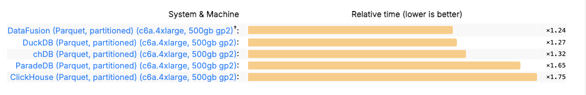
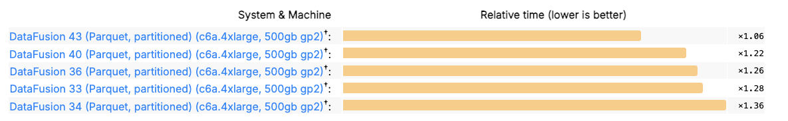
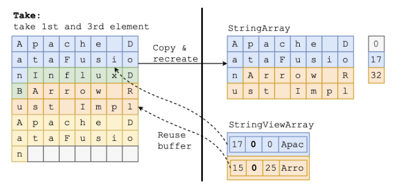
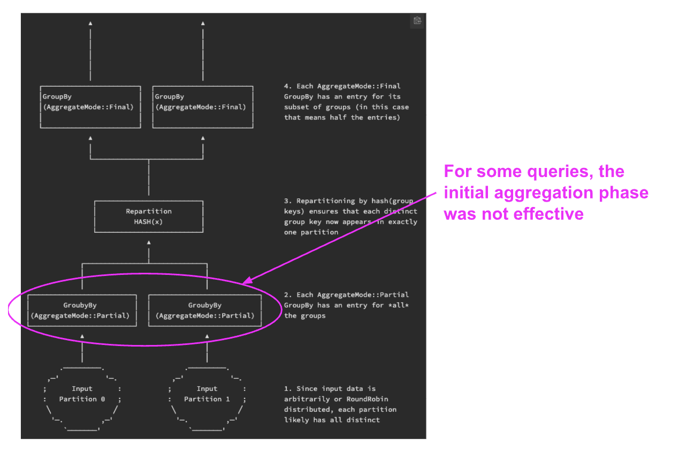
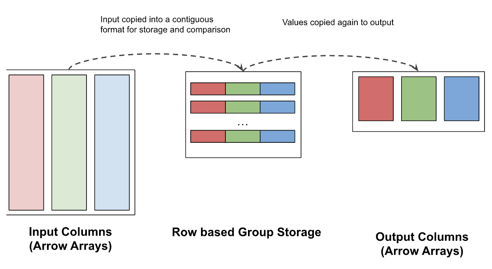
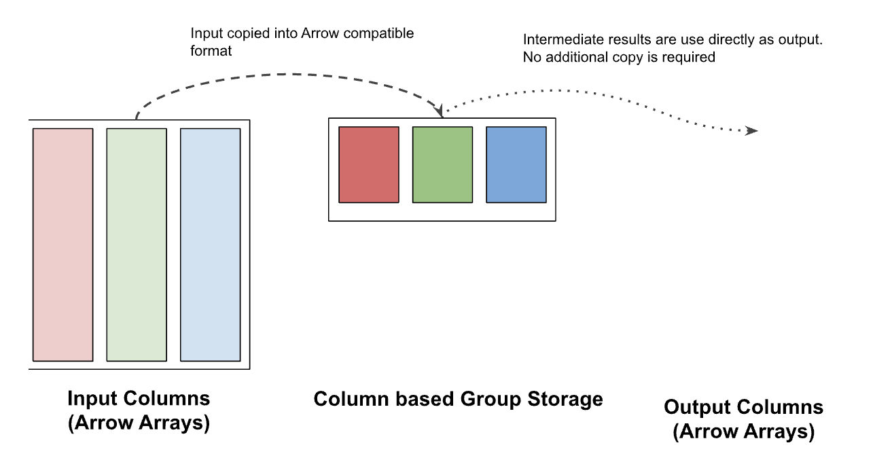

<!--

Licensed to the Apache Software Foundation (ASF) under one or more
contributor license agreements.  See the NOTICE file distributed with
this work for additional information regarding copyright ownership.
The ASF licenses this file to you under the Apache License, Version 2.0
(the "License"); you may not use this file except in compliance with
the License.  You may obtain a copy of the License at

http://www.apache.org/licenses/LICENSE-2.0

Unless required by applicable law or agreed to in writing, software
distributed under the License is distributed on an "AS IS" BASIS,
WITHOUT WARRANTIES OR CONDITIONS OF ANY KIND, either express or implied.
See the License for the specific language governing permissions and
limitations under the License.

-->

I am extremely excited to announce that [Apache DataFusion] [43.0.0]  is the
fastest engine for querying Apache Parquet files in [ClickBench]. It is faster
than [DuckDB], [chDB] and [Clickhouse] using the same hardware. It also marks
the first time a [Rust]-based engine holds the top spot, which has previously
been held by traditional C/C++-based engines.

[Apache DataFusion]: https://datafusion.apache.org/
[43.0.0]: https://crates.io/crates/datafusion
[ClickBench]: https://benchmark.clickhouse.com/
[DuckDB]: https://duckdb.org/
[chDB]: https://clickhouse.com/chdb
[Clickhouse]: https://clickhouse.com/ 
[Rust]: https://www.rust-lang.org/




**Figure 1**: 2024-11-16 [ClickBench Results] for the  ‘hot’[^1] run against the
partitioned 14 GB Parquet dataset (100 files, each ~140MB) on a `c6a.4xlarge` (16
CPU / 32 GB  RAM) VM. Measurements are relative (`1.x`) to results using
different hardware.

[ClickBench Results]: https://benchmark.clickhouse.com/#eyJzeXN0ZW0iOnsiQWxsb3lEQiI6ZmFsc2UsIkFsbG95REIgKHR1bmVkKSI6ZmFsc2UsIkF0aGVuYSAocGFydGl0aW9uZWQpIjpmYWxzZSwiQXRoZW5hIChzaW5nbGUpIjpmYWxzZSwiQXVyb3JhIGZvciBNeVNRTCI6ZmFsc2UsIkF1cm9yYSBmb3IgUG9zdGdyZVNRTCI6ZmFsc2UsIkJ5Q29uaXR5IjpmYWxzZSwiQnl0ZUhvdXNlIjpmYWxzZSwiY2hEQiAoRGF0YUZyYW1lKSI6ZmFsc2UsImNoREIgKFBhcnF1ZXQsIHBhcnRpdGlvbmVkKSI6dHJ1ZSwiY2hEQiI6ZmFsc2UsIkNpdHVzIjpmYWxzZSwiQ2xpY2tIb3VzZSBDbG91ZCAoYXdzKSI6ZmFsc2UsIkNsaWNrSG91c2UgQ2xvdWQgKGF6dXJlKSI6ZmFsc2UsIkNsaWNrSG91c2UgQ2xvdWQgKGdjcCkiOmZhbHNlLCJDbGlja0hvdXNlIChkYXRhIGxha2UsIHBhcnRpdGlvbmVkKSI6ZmFsc2UsIkNsaWNrSG91c2UgKGRhdGEgbGFrZSwgc2luZ2xlKSI6ZmFsc2UsIkNsaWNrSG91c2UgKFBhcnF1ZXQsIHBhcnRpdGlvbmVkKSI6dHJ1ZSwiQ2xpY2tIb3VzZSAoUGFycXVldCwgc2luZ2xlKSI6ZmFsc2UsIkNsaWNrSG91c2UgKHdlYikiOmZhbHNlLCJDbGlja0hvdXNlIjpmYWxzZSwiQ2xpY2tIb3VzZSAodHVuZWQpIjpmYWxzZSwiQ2xpY2tIb3VzZSAodHVuZWQsIG1lbW9yeSkiOmZhbHNlLCJDbG91ZGJlcnJ5IjpmYWxzZSwiQ3JhdGVEQiI6ZmFsc2UsIkNydW5jaHkgQnJpZGdlIGZvciBBbmFseXRpY3MgKFBhcnF1ZXQpIjpmYWxzZSwiRGF0YWJlbmQiOmZhbHNlLCJEYXRhRnVzaW9uIChQYXJxdWV0LCBwYXJ0aXRpb25lZCkiOnRydWUsIkRhdGFGdXNpb24gKFBhcnF1ZXQsIHNpbmdsZSkiOmZhbHNlLCJBcGFjaGUgRG9yaXMiOmZhbHNlLCJEcnVpZCI6ZmFsc2UsIkR1Y2tEQiAoRGF0YUZyYW1lKSI6ZmFsc2UsIkR1Y2tEQiAoUGFycXVldCwgcGFydGl0aW9uZWQpIjp0cnVlLCJEdWNrREIiOmZhbHNlLCJFbGFzdGljc2VhcmNoIjpmYWxzZSwiRWxhc3RpY3NlYXJjaCAodHVuZWQpIjpmYWxzZSwiR2xhcmVEQiI6ZmFsc2UsIkdyZWVucGx1bSI6ZmFsc2UsIkhlYXZ5QUkiOmZhbHNlLCJIeWRyYSI6ZmFsc2UsIkluZm9icmlnaHQiOmZhbHNlLCJLaW5ldGljYSI6ZmFsc2UsIk1hcmlhREIgQ29sdW1uU3RvcmUiOmZhbHNlLCJNYXJpYURCIjpmYWxzZSwiTW9uZXREQiI6ZmFsc2UsIk1vbmdvREIiOmZhbHNlLCJNb3RoZXJEdWNrIjpmYWxzZSwiTXlTUUwgKE15SVNBTSkiOmZhbHNlLCJNeVNRTCI6ZmFsc2UsIk94bGEiOmZhbHNlLCJQYW5kYXMgKERhdGFGcmFtZSkiOmZhbHNlLCJQYXJhZGVEQiAoUGFycXVldCwgcGFydGl0aW9uZWQpIjp0cnVlLCJQYXJhZGVEQiAoUGFycXVldCwgc2luZ2xlKSI6ZmFsc2UsIlBpbm90IjpmYWxzZSwiUG9sYXJzIChEYXRhRnJhbWUpIjpmYWxzZSwiUG9zdGdyZVNRTCAodHVuZWQpIjpmYWxzZSwiUG9zdGdyZVNRTCI6ZmFsc2UsIlF1ZXN0REIgKHBhcnRpdGlvbmVkKSI6ZmFsc2UsIlF1ZXN0REIiOmZhbHNlLCJSZWRzaGlmdCI6ZmFsc2UsIlNpbmdsZVN0b3JlIjpmYWxzZSwiU25vd2ZsYWtlIjpmYWxzZSwiU1FMaXRlIjpmYWxzZSwiU3RhclJvY2tzIjpmYWxzZSwiVGFibGVzcGFjZSI6ZmFsc2UsIlRlbWJvIE9MQVAgKGNvbHVtbmFyKSI6ZmFsc2UsIlRpbWVzY2FsZURCIChubyBjb2x1bW5zdG9yZSkiOmZhbHNlLCJUaW1lc2NhbGVEQiI6ZmFsc2UsIlRpbnliaXJkIChGcmVlIFRyaWFsKSI6ZmFsc2UsIlVtYnJhIjpmYWxzZX0sInR5cGUiOnsiQyI6dHJ1ZSwiY29sdW1uLW9yaWVudGVkIjp0cnVlLCJQb3N0Z3JlU1FMIGNvbXBhdGlibGUiOnRydWUsIm1hbmFnZWQiOnRydWUsImdjcCI6dHJ1ZSwic3RhdGVsZXNzIjp0cnVlLCJKYXZhIjp0cnVlLCJDKysiOnRydWUsIk15U1FMIGNvbXBhdGlibGUiOnRydWUsInJvdy1vcmllbnRlZCI6dHJ1ZSwiQ2xpY2tIb3VzZSBkZXJpdmF0aXZlIjp0cnVlLCJlbWJlZGRlZCI6dHJ1ZSwic2VydmVybGVzcyI6dHJ1ZSwiZGF0YWZyYW1lIjp0cnVlLCJhd3MiOnRydWUsImF6dXJlIjp0cnVlLCJhbmFseXRpY2FsIjp0cnVlLCJSdXN0Ijp0cnVlLCJzZWFyY2giOnRydWUsImRvY3VtZW50Ijp0cnVlLCJzb21ld2hhdCBQb3N0Z3JlU1FMIGNvbXBhdGlibGUiOnRydWUsInRpbWUtc2VyaWVzIjp0cnVlfSwibWFjaGluZSI6eyIxNiB2Q1BVIDEyOEdCIjp0cnVlLCI4IHZDUFUgNjRHQiI6dHJ1ZSwic2VydmVybGVzcyI6dHJ1ZSwiMTZhY3UiOnRydWUsImM2YS40eGxhcmdlLCA1MDBnYiBncDIiOnRydWUsIkwiOnRydWUsIk0iOnRydWUsIlMiOnRydWUsIlhTIjp0cnVlLCJjNmEubWV0YWwsIDUwMGdiIGdwMiI6ZmFsc2UsIjE5MkdCIjp0cnVlLCIyNEdCIjp0cnVlLCIzNjBHQiI6dHJ1ZSwiNDhHQiI6dHJ1ZSwiNzIwR0IiOnRydWUsIjk2R0IiOnRydWUsImRldiI6dHJ1ZSwiNzA4R0IiOnRydWUsImM1bi40eGxhcmdlLCA1MDBnYiBncDIiOnRydWUsIkFuYWx5dGljcy0yNTZHQiAoNjQgdkNvcmVzLCAyNTYgR0IpIjp0cnVlLCJjNS40eGxhcmdlLCA1MDBnYiBncDIiOnRydWUsImM2YS40eGxhcmdlLCAxNTAwZ2IgZ3AyIjp0cnVlLCJjbG91ZCI6dHJ1ZSwiZGMyLjh4bGFyZ2UiOnRydWUsInJhMy4xNnhsYXJnZSI6dHJ1ZSwicmEzLjR4bGFyZ2UiOnRydWUsInJhMy54bHBsdXMiOnRydWUsIlMyIjp0cnVlLCJTMjQiOnRydWUsIjJYTCI6dHJ1ZSwiM1hMIjp0cnVlLCI0WEwiOnRydWUsIlhMIjp0cnVlLCJMMSAtIDE2Q1BVIDMyR0IiOnRydWUsImM2YS40eGxhcmdlLCA1MDBnYiBncDMiOnRydWV9LCJjbHVzdGVyX3NpemUiOnsiMSI6dHJ1ZSwiMiI6dHJ1ZSwiNCI6dHJ1ZSwiOCI6dHJ1ZSwiMTYiOnRydWUsIjMyIjp0cnVlLCI2NCI6dHJ1ZSwiMTI4Ijp0cnVlLCJzZXJ2ZXJsZXNzIjp0cnVlfSwibWV0cmljIjoiaG90IiwicXVlcmllcyI6W3RydWUsdHJ1ZSx0cnVlLHRydWUsdHJ1ZSx0cnVlLHRydWUsdHJ1ZSx0cnVlLHRydWUsdHJ1ZSx0cnVlLHRydWUsdHJ1ZSx0cnVlLHRydWUsdHJ1ZSx0cnVlLHRydWUsdHJ1ZSx0cnVlLHRydWUsdHJ1ZSx0cnVlLHRydWUsdHJ1ZSx0cnVlLHRydWUsdHJ1ZSx0cnVlLHRydWUsdHJ1ZSx0cnVlLHRydWUsdHJ1ZSx0cnVlLHRydWUsdHJ1ZSx0cnVlLHRydWUsdHJ1ZSx0cnVlLHRydWVdfQ==


Best in class performance on Parquet is now available to anyone. DataFusion’s
open design lets you start quickly with a full featured Query Engine, including
SQL, data formats, catalogs, and more, and then customize any behavior you need.
I predict the continued emergence of new classes of data systems now that
creators can focus the bulk of their innovation on areas such as query
languages, system integrations, and data formats rather than trying to play
catchup with core engine performance.

ClickBench also includes results for proprietary storage formats, which require
costly load / export steps, making them useful in fewer use cases and thus much
less important than open formats (though the idea of use case specific formats
is interesting[^2]).

This blog post highlights some of the techniques we used to achieve this
performance, and celebrates the teamwork involved.

# A Strong History of Performance Improvements 

Performance has long been a core focus for DataFusion's community, and 
speed attracts users and contributors. Recently, we seem to have been
even more focused on performance, including in July, 2024 when [Mehmet Ozan
Kabak], CEO of [Synnada], again [suggested focusing on performance]. This
got many of us excited (who doesn’t love a challenge!), and we have subsequently
rallied to steadily improve the performance release on release as shown in
Figure 2.

[Mehmet Ozan Kabak]: https://www.linkedin.com/in/mehmet-ozan-kabak/
[Synnada]: https://www.synnada.ai/
[suggested focusing on performance]: https://github.com/apache/datafusion/issues/11442#issuecomment-2226834443



**Figure 2**: ClickBench performance improved over 30% between DataFusion 34
(released Dec. 2023) and DataFusion 43 (released Nov. 2024).

Like all good optimization efforts, ours took sustained effort as DataFusion ran
out of [single 2x performance improvements] several years ago. Working together our
community of engineers from around the world[^3] and all experience levels[^4]
pulled it off (check out [this discussion] to get a sense). It may be a "[hobo
sandwich]" [^5], but it is a tasty one!

[single 2x performance improvements]: https://www.influxdata.com/blog/aggregating-millions-groups-fast-apache-arrow-datafusion
[this discussion]: https://github.com/apache/datafusion/issues/12821
[hobo sandwich]: https://db.cs.cmu.edu/seminar2024/

Of course, most of these techniques have been implemented and described before,
but until now they were only available in proprietary systems such as
[Vertica](https://www.vertica.com/), [DataBricks
Photon](https://www.databricks.com/product/photon), or
[Snowflake](https://www.snowflake.com/en/) or in tightly integrated open source
systems such as [DuckDB](https://duckdb.org/) or
[ClickHouse](https://clickhouse.com/) which were not designed to be extended.


## StringView

Performance improved for all queries when DataFusion switched to using Arrow
`StringView`. Using `StringView` “just” saves some copies and avoids one memory
access for certain comparisons. However, these copies and comparisons happen to
occur in many of the hottest loops during query processing, so optimizing them
resulted in measurable performance improvements.



**Figure 3:** Figure from [Using StringView / German Style Strings to Make
Queries Faster: Part 1] showing how `StringView` saves copying data in many cases.

Using StringView to make DataFusion faster for ClickBench required substantial
careful, low level optimization work described in [Using StringView / German
Style Strings to Make Queries Faster: Part 1] and [Part 2]. However, it *also*
required extending the rest of DataFusion’s operations to support the new type.
You can get a sense of the magnitude of the work required by looking at the 100+
pull requests linked to the epic in arrow-rs
([here](https://github.com/apache/arrow-rs/issues/5374)) and three major epics
([here](https://github.com/apache/datafusion/issues/10918),
[here](https://github.com/apache/datafusion/issues/11790) and
[here](https://github.com/apache/datafusion/issues/11752)) in DataFusion.

[Using StringView / German Style Strings to Make Queries Faster: Part 1]: https://www.influxdata.com/blog/faster-queries-with-stringview-part-one-influxdb/
[Part 2]: https://www.influxdata.com/blog/faster-queries-with-stringview-part-two-influxdb/

Here is a partial list of people involved in the project (I am sorry to those whom I forgot)

* **Arrow**:  [Xiangpeng Hao](https://github.com/XiangpengHao) (InfluxData’s amazing 2024 summer intern and UW Madison PhD), [Yijun Zhao](https://github.com/ariesdevil) from DataBend Labs, and [Raphael Taylor-Davies](https://github.com/tustvold) laid the foundation.  [RinChanNOW](https://github.com/RinChanNOWWW) from Tencent and [Andrew Duffy](https://github.com/a10y) from SpiralDB helped push it along in the early days, and [Liang-Chi Hsieh](https://github.com/viirya), [Daniël Heres](https://github.com/Dandandan) reviewed and provided guidance.
* **DataFusion**:  [Xiangpeng Hao](https://github.com/XiangpengHao), again charted the initial path and [Weijun Huang](https://github.com/Weijun-H), [Dharan Aditya](https://github.com/dharanad) [Lordworms](https://github.com/Lordworms), [Jax Liu](https://github.com/goldmedal),  [wiedld](https://github.com/wiedld), [Tai Le Manh](https://github.com/tlm365), [yi wang](https://github.com/my-vegetable-has-exploded), [doupache](https://github.com/doupache), [Jay Zhan](https://github.com/jayzhan211) , [Xin Li](https://github.com/xinlifoobar)  and [Kaifeng Zheng](https://github.com/Kev1n8) made it real.
* **DataFusion String Function Migration**:  [Trent Hauck](https://github.com/tshauck) organized the effort and set the patterns, [Jax Liu](https://github.com/goldmedal) made a clever testing framework, and [Austin Liu](https://github.com/austin362667), [Dmitrii Bu](https://github.com/demetribu), [Tai Le Manh](https://github.com/tlm365), [Chojan Shang](https://github.com/PsiACE), [WeblWabl](https://github.com/devanbenz), [Lordworms](https://github.com/Lordworms), [iamthinh](https://github.com/thinh2), [Bruce Ritchie](https://github.com/Omega359), [Kaifeng Zheng](https://github.com/Kev1n8), and [Xin Li](https://github.com/xinlifoobar) bashed out the conversions.


## Parquet

Part of the reason for DataFusion's speed in ClickBench is reading Parquet files (really) quickly,
which reflects invested effort in the Parquet reading system (see [Querying
Parquet with Millisecond Latency] )

The [DataFusion ParquetExec] (built on the [Rust Parquet Implementation]) is now the most
sophisticated open source Parquet reader I know of. It has every optimization we
can think of for reading Parquet, including projection pushdown, predicate
pushdown (row group metadata, page index, and bloom filters), limit pushdown,
parallel reading, interleaved I/O, and late materialized filtering (coming soon ™️
by default). Some recent work from [June](https://github.com/itsjunetime)
[recently unblocked a remaining hurdle] for enabling late materialized
filtering, and conveniently [Xiangpeng Hao](https://github.com/XiangpengHao) is
working on the [final piece] (no pressure😅)

[recently unblocked a remaining hurdle]: https://github.com/apache/datafusion/pull/12135
[final piece]: https://github.com/apache/arrow-datafusion/issues/3463

[Querying Parquet with Millisecond Latency]: https://www.influxdata.com/blog/querying-parquet-millisecond-latency/
[DataFusion ParquetExec]: https://docs.rs/datafusion/latest/datafusion/datasource/physical_plan/parquet/struct.ParquetExec.html
[Rust Parquet Implementation]: https://crates.io/crates/parquet

## Skipping Partial Aggregation When It Doesn't Help

Many ClickBench queries are aggregations that summarize millions of rows, a
common task for reporting and dashboarding. DataFusion uses state of the art
[two phase aggregation] plans. Normally, two phase aggregation works well as the
first phase consolidates many rows immediately after reading, while the data is
still in cache. However, for certain “high cardinality” aggregate queries (that
have large numbers of groups), [the two phase aggregation strategy used in
DataFusion was inefficient](https://github.com/apache/datafusion/issues/6937),
manifesting in relatively slower performance compared to other engines for
ClickBench queries such as

```sql
SELECT "WatchID", "ClientIP", COUNT(*) AS c, ... 
FROM hits 
GROUP BY "WatchID", "ClientIP" /* <----- 13M Distinct Groups!!! */
ORDER BY c DESC 
LIMIT 10;
```

For such queries, the first aggregation phase does not significantly
reduce the number of rows, which wastes significant effort. [Eduard
Karacharov](https://github.com/korowa) contributed a [dynamic strategy] to
bypass the first phase when it is not working efficiently, shown in Figure 4.

[two phase aggregation]: https://docs.rs/datafusion/latest/datafusion/physical_plan/trait.Accumulator.html#tymethod.state
[dynamic strategy]: https://github.com/apache/datafusion/pull/11627



**Figure 4**: Diagram from [DataFusion API docs] showing when the multi-phase
grouping is not effective

[DataFusion API docs]: https://docs.rs/datafusion/latest/datafusion/physical_plan/trait.Accumulator.html#tymethod.state

## Optimized Multi-Column Grouping

Another method for improving analytic database performance is specialized (aka
highly optimized) versions of operations for different data types, which the
system picks at runtime based on the query. Like other systems, DataFusion has
specialized code for handling different types of group columns. For example,
there is [special code] that handles `GROUP BY int_id`  and [different special
code] that handles `GROUP BY string_id` .

[special code]: https://github.com/apache/datafusion/blob/73507c307487708deb321e1ba4e0d302084ca27e/datafusion/physical-plan/src/aggregates/group_values/single_group_by/primitive.rs
[different special code]: https://github.com/apache/datafusion/blob/73507c307487708deb321e1ba4e0d302084ca27e/datafusion/physical-plan/src/aggregates/group_values/single_group_by/bytes.rs

When a query groups by multiple columns, it is tricker to apply this technique.
For example `GROUP BY string_id, int_id` and `GROUP BY int_id, string_id` have
different optimal structures, but it is not possible to include specialized
versions for all possible combinations of group column types.

DataFusion includes [a general Row based mechanism] that works for any
combination of column types, but this general mechanism copies each value twice
as shown in Figure 5. The cost of this copy [is especially high for variable
length strings and binary data].

[a general Row based mechanism]: https://github.com/apache/datafusion/blob/73507c307487708deb321e1ba4e0d302084ca27e/datafusion/physical-plan/src/aggregates/group_values/row.rs#L33-L39
[is especially high for variable length strings and binary data]: https://github.com/apache/datafusion/issues/9403



**Figure 5**: Prior to DataFusion 43.0.0, queries with multiple group columns
used Row based group storage and copied each group value twice. This copy
consumes a substantial amount of the query time for queries with many distinct
groups, such as several of the queries in ClickBench.

Many optimizations in Databases boil down to simply avoiding copies, and this
was no exception. The trick was to figure out how to avoid copies without
causing per-column comparison overhead to dominate or complexity to get out of
hand. In a great example of diligent and disciplined engineering, [Jay
Zhan](https://github.com/jayzhan211) tried [several], [different] approaches until arriving
at the [one shipped in DataFusion `43.0.0`], shown in Figure 6.

[several]: https://github.com/apache/datafusion/pull/10937
[different]: https://github.com/apache/datafusion/pull/10976
[one shipped in DataFusion `43.0.0`]: https://github.com/apache/datafusion/pull/12269



**Figure 6**: DataFusion 43.0.0’s new columnar group storage copies each group
value exactly once, which is significantly faster when grouping by multiple
columns.

Huge thanks as well to [Emil Ejbyfeldt](https://github.com/eejbyfeldt) and
[Daniël Heres](https://github.com/Dandandan) for their help reviewing and to
[Rachelint (kamille](https://github.com/Rachelint)) for reviewing and
contributing a faster [vectorized append and compare for multiple groups] which
will be released in DataFusion 44. The discussion on [the ticket] is another
great example of the power of the DataFusion community working together to build
great software.

[vectorized append and compare for multiple groups]: https://github.com/apache/datafusion/pull/12996
[the ticket]: https://github.com/apache/datafusion/issues/9403

# What’s Next 🚀

Just as I expect the performance of other engines to improve, DataFusion has
several more performance improvements lined up itself:

1. [Intermediate results blocked management](https://github.com/apache/datafusion/pull/11943#top) (thanks again [Rachelint (kamille](https://github.com/Rachelint))
2. [Enable parquet filter pushdown by default](https://github.com/apache/datafusion/issues/3463)

We are also talking about what to focus on over the [next three
months](https://github.com/apache/datafusion/issues/13274) and are always
looking for people to help! If you want to geek out (obsess??) about performance
and other features with engineers from around the world, [we would love you to
join us](https://datafusion.apache.org/contributor-guide/communication.html).


# Additional Thanks

In addition to the people called out above, thanks:

1. [Patrick McGleenon](https://github.com/pmcgleenon) for running ClickBench and gathering this data ([source](https://github.com/apache/datafusion/issues/13099#issuecomment-2478314793)).
2. Everyone I missed in the shoutouts – there are so many of you. We appreciate everyone.


# Conclusion

I have dreamed about DataFusion being on top of the ClickBench leaderboard for
several years. I often watched with envy improvements in systems backed by large
VC investments, internet companies, or world class research institutions, and
doubted that we could pull off something similar in an open source project with
always limited time.

The fact that we have now surpassed those other systems in query performance I
think speaks to the power and possibility of focusing on community and aligning
our collective enthusiasm and skills towards a common goal. Of course, being on
the top in any particular benchmark is likely fleeting as other engines will
improve, but so will DataFusion!

I love working on DataFusion – the people, the quality of the code, my
interactions and the results we have achieved together far surpass my
expectations as well as most of my other software development experiences. I
can’t wait to see what people will build next, and hope to [see you
online](https://github.com/apache/datafusion).


## Notes

[^1]: Note that DuckDB is slightly faster on the ‘cold’ run.

[^2]: Want to try your hand at a custom format for ClickBench fame / glory?: [Make DataFusion the fastest engine in ClickBench with custom file format](https://github.com/apache/datafusion/issues/13448)

[^3]: We have contributors from North America, South American, Europe, Asia, Africa and Australia

[^4]: Undergraduates, PhD, Junior engineers, and getting-kind-of-crotchety experienced engineers

[^5]: Thanks to Andy Pavlo, I love that nomenclature
